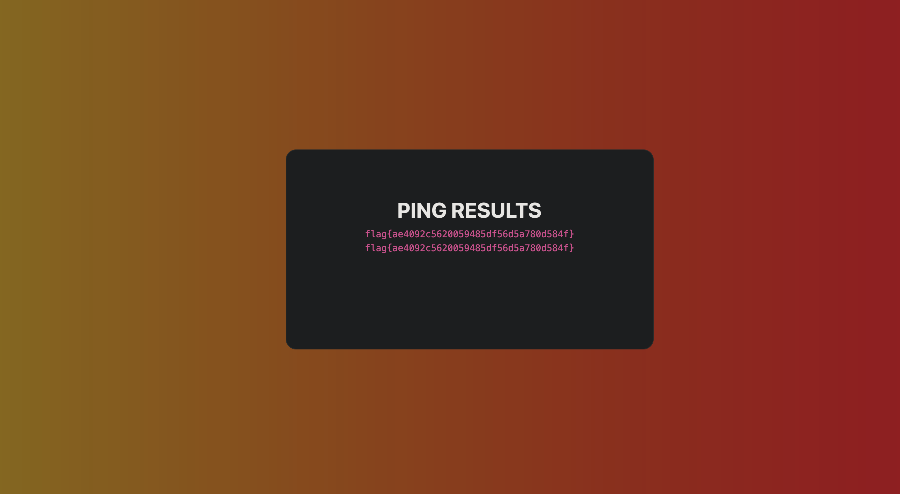

# Week 10: CTF

## Goal

> Explore web apps vulnerabilities

### Challenge 1

> In this first challenge we started by seeing that the input field for the justification to give to the admin was not sanitized so we could use javascript to try to get the flag.
>
> We made a dummy justification and after that we got to a page where we could see that there were a button that said "Give the flag" but was disabled. However we knew that in the admin page this buttons weren't disabled so we analized the source code of the page :
> 
>
> We knew that the button had id="giveflag" so we used javascript and the DOM:
> 
>
> This would mean that when the admin analyzed our justification it would click on the "Give the flag" button.
>
> After submitting:
> 

### Challenge 2

> We started by analyzing the features that us, users not authenticated, could perform and we saw that we could ping hosts.
>
> We then used this ping functionality and figured that this was using the ping command from linux because of the input that it was giving.
>
> Therefore we could exploit this to chain multiple linux commands to access the flag.txt file and get the flag.
>
> We started by using ls and cd to navigate through the file system until we found the "flags" folder:
> 
> After submitting:
> 
