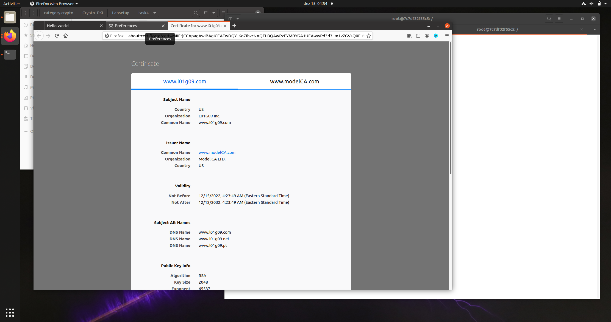
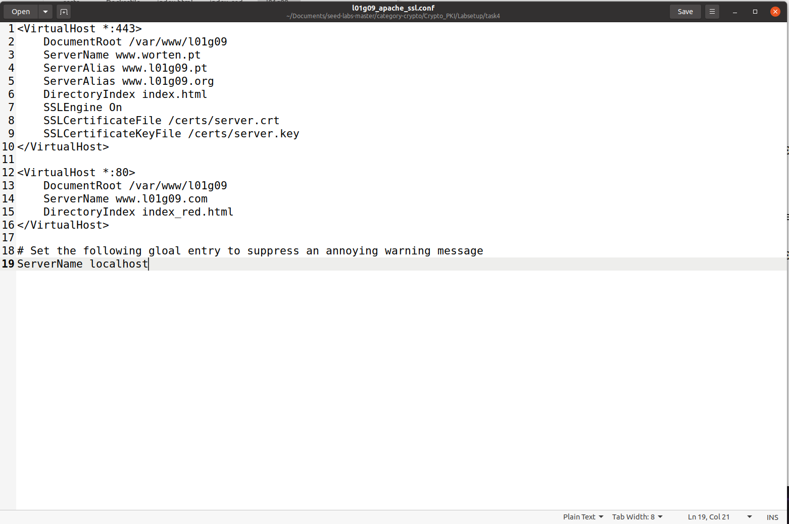

# Public-Key Infrastructure (PKI) Lab

## Task 1: Becoming a Certificate Authority (CA)

In this lab we need to create digital certificates, we'll become a root CA ourselves and then generate a certificate for others. In this task, we'll make ourselves a root CA and generate a certificate for this CA.

Firstly in order to make changes to the configuration file we need to copy the file into our current directory:
```bash
cp /usr/lib/ssl/openssl.cnf myCA_openssl.cnf
```
Inside the *openssl.cnf* file, under the *CA_default* section, the default settings that we need to prepare. 
```
[ CA_default ]
dir = ./demoCA # Where everything is kept
certs = $dir/certs # Where the issued certs are kept
crl_dir = $dir/crl # Where the issued crl are kept
database = $dir/index.txt # database index file.
#unique_subject = no # Set to ’no’ to allow creation of
# several certs with same subject.
new_certs_dir = $dir/newcerts # default place for new certs.
serial
```
Then we need to create the ```demoCA``` and add the necessary folders and files on it, like this:
```c
mkdir demoCA/ # create folder
mkdir certs crl newcerts # create folder
touch index.txt # create file
echo "1000" > serial # write to file
```

The next step consists in creating the self-signed CA certificate, using the given command:
```
openssl req -x509 -newkey rsa:4096 -sha256 -days 3650 \ keyout ca.key -out ca.crt \ subj "/CN=www.modelCA.com/O=Model CA LTD./C=US" \ passout pass:dees
```

The following image shows the original steps taken to achieve this task:


certificate:
```
Certificate:
    Data:
        Version: 3 (0x2)
        Serial Number:
            6e:58:e5:a3:f4:a6:b4:5f:bf:cd:bc:4b:42:70:da:a0:05:98:07:ba
        Signature Algorithm: sha256WithRSAEncryption
        Issuer: CN = www.modelCA.com, O = Model CA LTD., C = US
        Validity
            Not Before: Dec 15 09:02:44 2022 GMT
            Not After : Dec 12 09:02:44 2032 GMT
        Subject: CN = www.modelCA.com, O = Model CA LTD., C = US
        Subject Public Key Info:
            Public Key Algorithm: rsaEncryption
                RSA Public-Key: (4096 bit)
                Modulus:
                    00:ab:ba:29:fa:62:a3:02:ec:09:e9:13:f0:de:5e:
                    ab:1b:73:07:42:86:76:9a:de:ca:c9:e3:73:45:39:
                    22:10:fc:29:ba:a3:25:0c:c0:b4:5e:c1:36:b8:3a:
                    f8:e6:01:f9:dd:aa:0f:71:5f:e4:b3:38:b1:67:ba:
                    73:5e:e3:95:8a:05:09:de:1b:b4:39:6c:f7:7d:5c:
                    08:96:b5:b5:7f:ee:3e:c2:74:de:b3:f9:9b:83:c7:
                    6c:34:5e:72:b6:4b:28:3a:b4:17:19:61:12:2c:50:
                    21:ba:ad:01:a5:62:85:0e:22:3f:ad:ea:11:90:b1:
                    89:47:c4:72:1a:2c:b9:89:f1:55:0b:36:45:b9:75:
                    e8:31:2f:63:b5:3a:93:65:02:d2:5e:3e:98:3a:47:
                    d9:b7:9c:1c:b7:6a:6b:81:9a:3e:57:fb:19:ca:20:
                    9d:1c:62:a5:d8:36:29:6f:c9:a7:88:71:bf:bb:fb:
                    36:66:b6:b8:98:d3:e8:49:8f:b2:54:a8:16:90:2a:
                    85:99:ab:67:7e:f7:24:90:8e:f5:04:37:4d:1d:97:
                    3a:df:6b:92:0b:73:34:1a:66:e4:a9:03:47:bc:ff:
                    4e:08:e7:fc:d6:87:6e:03:25:44:75:17:84:fe:b5:
                    b0:da:b6:8b:6d:85:c7:14:68:26:89:31:40:1f:f4:
                    b5:01:a1:62:b0:81:0f:4e:1a:66:3c:73:ce:bb:08:
                    23:95:56:58:7a:72:92:3c:b4:8d:fc:88:1a:12:4d:
                    da:6d:bb:68:e6:20:ac:4f:5f:2f:a6:09:05:47:d6:
                    73:a1:0f:9a:16:66:51:df:e2:14:51:8a:68:d0:11:
                    a0:3c:6b:54:88:0a:cb:03:be:b6:5f:29:55:4e:ec:
                    0f:1b:ed:64:80:0d:8f:89:a9:3b:c9:75:5e:6b:f6:
                    de:d5:0c:fd:7f:9f:3e:18:30:9e:0d:9d:31:99:d8:
                    39:17:31:29:7b:06:54:3e:ea:41:c7:d9:2d:1e:f5:
                    74:87:dd:6e:2d:fa:51:18:c6:c8:7a:53:7f:17:88:
                    f0:49:53:3a:ca:c9:15:c8:5a:d3:c1:d8:7e:9f:6c:
                    16:9d:23:d8:68:24:c9:30:66:79:e9:e2:96:a5:3b:
                    73:e2:dc:93:8d:b6:e3:10:0a:da:b7:c2:67:72:e7:
                    bf:41:37:a0:7a:95:34:de:5a:54:01:bf:9a:7f:5f:
                    9e:5b:91:33:9c:3a:01:cb:f7:e9:0c:4e:de:73:07:
                    ca:71:04:7f:38:07:5f:0c:74:e3:5e:20:7c:95:7d:
                    4f:62:a1:bd:5c:a0:8b:30:79:72:10:8a:25:e3:b6:
                    9b:7b:58:03:b0:c4:e2:33:48:2c:65:ac:7a:bf:3c:
                    79:e5:d7
                Exponent: 65537 (0x10001)
        X509v3 extensions:
            X509v3 Subject Key Identifier: 
                7B:DB:49:1F:18:F6:2C:69:01:12:01:2F:B6:72:D4:31:84:71:77:71
            X509v3 Authority Key Identifier: 
                keyid:7B:DB:49:1F:18:F6:2C:69:01:12:01:2F:B6:72:D4:31:84:71:77:71

            X509v3 Basic Constraints: critical
                CA:TRUE
    Signature Algorithm: sha256WithRSAEncryption
         47:c3:6c:7b:32:c2:42:95:20:20:01:98:0b:2d:49:63:4a:08:
         2f:0b:b9:66:b1:88:2f:f1:9c:e0:14:e3:95:ae:7d:9b:67:b9:
         26:6c:5e:fe:f7:12:b2:32:fb:7c:dd:32:53:5a:6a:b5:88:24:
         55:d8:44:9e:fb:db:ca:4c:3a:99:f0:53:82:08:50:ce:33:c2:
         70:a6:a2:12:08:b2:c9:23:a1:28:88:45:69:c6:b1:c0:f7:52:
         0d:20:03:d2:a8:a0:7f:e9:84:8f:c0:f2:45:24:1d:30:c7:52:
         0c:aa:79:a4:47:02:ef:9c:84:08:61:c8:ad:93:b5:4f:fe:45:
         b7:b5:b6:d4:31:7d:7c:e3:04:13:f2:a8:14:96:27:a6:c7:13:
         90:2c:65:af:ee:4a:3b:4e:18:5a:82:3f:42:6c:64:7f:5c:c7:
         93:d7:9f:43:58:f2:1d:8d:a5:0f:f9:8e:fe:3f:5d:67:2d:01:
         0b:7c:74:66:86:33:a2:8d:c9:56:0b:d8:0d:76:fd:cf:2d:2f:
         47:8c:56:00:48:16:e2:aa:ce:55:5c:0c:f6:69:17:2a:09:61:
         70:55:0e:fd:7b:ae:33:42:d9:9f:47:b0:fd:38:1c:15:3c:e2:
         3c:0b:a1:6d:68:cc:3a:8d:45:da:ce:8d:f4:9a:26:e5:27:9c:
         97:75:d2:f7:63:07:52:fd:18:c0:da:d9:6b:83:03:1b:33:ac:
         0b:b9:66:73:d2:c5:ed:1e:fe:3d:77:b3:b3:da:b7:e7:78:cc:
         e6:1a:aa:f3:de:e3:ad:ce:db:ca:be:54:90:f0:11:c6:a0:db:
         db:66:61:7e:67:61:f6:4d:d1:f3:05:96:fc:8c:fe:73:7d:1a:
         59:17:05:5d:d9:19:ef:32:d6:4b:7a:1c:90:87:57:2a:96:77:
         88:e3:f9:13:e1:72:f1:32:aa:d7:06:c4:15:04:5b:2d:f4:04:
         86:b8:4e:96:c9:c2:7f:67:74:24:cc:0d:6c:b9:d3:49:39:0d:
         67:4c:b5:81:7d:3d:9f:8b:25:cb:d6:51:4a:1a:4b:49:a0:22:
         72:6c:29:f4:6d:65:30:fe:93:c1:6f:ac:bf:a5:9c:28:80:da:
         53:6f:aa:46:c7:0d:8c:2b:f0:34:63:09:fd:fb:c5:e9:8a:75:
         c7:5b:a8:c6:84:12:97:7e:2b:e8:80:1d:76:7c:03:64:07:03:
         4d:a1:68:3a:a3:c2:1c:cd:40:7e:79:41:c3:92:f0:2c:bc:70:
         2c:8f:b8:c1:32:69:e5:b6:b3:c3:d3:c2:73:39:8c:91:8f:ee:
         79:8e:02:81:d0:e2:8c:66:dd:d4:95:c9:10:2b:e7:24:9d:d6:
         82:c7:e5:79:15:51:c4:69
```

### Questions
> **What part of the certificate indicates this is a CA's certificate?**  
>  In the section *basic constraints* the attribute *CA* is set to TRUE, indicating that it is a CA's certificate.

> **What part of the certificate indicates this is a self-signed certificate?**  
> In the *extensions* section, we can find the subject key identifier and the authority key identifier. This two are identifical, there is, the subject and the issuer are the same, therefore this is a self-signed certificate. Plus, when creating the certificate, we used the flag *-x509*, which is used to create self-signed certificates.

> **In the RSA algorithm, we have a public exponent e, a private exponent d, a modulus n, and two secret numbers p and q, such that n = pq. Please identify the values for these elements in your certificate and key files**  
> Considering the following key, the values n (modulus), public exponent (publicExponent), d (privateExponent), p (prime1) and (prime2) are displayed:
```
Enter pass phrase for ca.key:
RSA Private-Key: (4096 bit, 2 primes)
modulus:
    00:ab:ba:29:fa:62:a3:02:ec:09:e9:13:f0:de:5e:
    ab:1b:73:07:42:86:76:9a:de:ca:c9:e3:73:45:39:
    22:10:fc:29:ba:a3:25:0c:c0:b4:5e:c1:36:b8:3a:
    f8:e6:01:f9:dd:aa:0f:71:5f:e4:b3:38:b1:67:ba:
    73:5e:e3:95:8a:05:09:de:1b:b4:39:6c:f7:7d:5c:
    08:96:b5:b5:7f:ee:3e:c2:74:de:b3:f9:9b:83:c7:
    6c:34:5e:72:b6:4b:28:3a:b4:17:19:61:12:2c:50:
    21:ba:ad:01:a5:62:85:0e:22:3f:ad:ea:11:90:b1:
    89:47:c4:72:1a:2c:b9:89:f1:55:0b:36:45:b9:75:
    e8:31:2f:63:b5:3a:93:65:02:d2:5e:3e:98:3a:47:
    d9:b7:9c:1c:b7:6a:6b:81:9a:3e:57:fb:19:ca:20:
    9d:1c:62:a5:d8:36:29:6f:c9:a7:88:71:bf:bb:fb:
    36:66:b6:b8:98:d3:e8:49:8f:b2:54:a8:16:90:2a:
    85:99:ab:67:7e:f7:24:90:8e:f5:04:37:4d:1d:97:
    3a:df:6b:92:0b:73:34:1a:66:e4:a9:03:47:bc:ff:
    4e:08:e7:fc:d6:87:6e:03:25:44:75:17:84:fe:b5:
    b0:da:b6:8b:6d:85:c7:14:68:26:89:31:40:1f:f4:
    b5:01:a1:62:b0:81:0f:4e:1a:66:3c:73:ce:bb:08:
    23:95:56:58:7a:72:92:3c:b4:8d:fc:88:1a:12:4d:
    da:6d:bb:68:e6:20:ac:4f:5f:2f:a6:09:05:47:d6:
    73:a1:0f:9a:16:66:51:df:e2:14:51:8a:68:d0:11:
    a0:3c:6b:54:88:0a:cb:03:be:b6:5f:29:55:4e:ec:
    0f:1b:ed:64:80:0d:8f:89:a9:3b:c9:75:5e:6b:f6:
    de:d5:0c:fd:7f:9f:3e:18:30:9e:0d:9d:31:99:d8:
    39:17:31:29:7b:06:54:3e:ea:41:c7:d9:2d:1e:f5:
    74:87:dd:6e:2d:fa:51:18:c6:c8:7a:53:7f:17:88:
    f0:49:53:3a:ca:c9:15:c8:5a:d3:c1:d8:7e:9f:6c:
    16:9d:23:d8:68:24:c9:30:66:79:e9:e2:96:a5:3b:
    73:e2:dc:93:8d:b6:e3:10:0a:da:b7:c2:67:72:e7:
    bf:41:37:a0:7a:95:34:de:5a:54:01:bf:9a:7f:5f:
    9e:5b:91:33:9c:3a:01:cb:f7:e9:0c:4e:de:73:07:
    ca:71:04:7f:38:07:5f:0c:74:e3:5e:20:7c:95:7d:
    4f:62:a1:bd:5c:a0:8b:30:79:72:10:8a:25:e3:b6:
    9b:7b:58:03:b0:c4:e2:33:48:2c:65:ac:7a:bf:3c:
    79:e5:d7
publicExponent: 65537 (0x10001)
privateExponent:
    36:bc:fe:88:7b:4c:6e:b0:02:70:b3:14:82:2d:36:
    e9:66:ff:17:6b:78:fe:e0:a9:4f:35:1b:17:23:a1:
    02:3c:fe:a8:29:3c:b4:15:f0:e8:8b:39:ff:fb:7c:
    3f:04:be:3a:b3:ec:7c:3d:0e:cf:39:f1:02:99:62:
    11:0b:06:2d:9a:71:8c:c4:d3:eb:c2:1a:19:71:6e:
    a3:6b:84:51:25:06:08:41:ec:82:fd:bb:5e:84:00:
    af:a8:b3:73:fb:fc:f4:c9:56:db:96:1f:8e:d4:74:
    0b:e6:fd:b1:53:f8:09:8b:4d:35:08:79:54:df:e2:
    5c:67:f7:de:f4:06:a8:3b:ae:da:06:10:af:8f:2f:
    d6:0d:bf:00:93:8d:4c:13:5c:2f:02:50:cf:b2:fb:
    69:15:6f:e9:df:18:29:95:9a:ed:bc:72:7a:05:6f:
    4f:0e:fa:c2:32:71:7e:da:8e:76:65:9b:b2:35:df:
    1f:5a:7a:f8:ec:03:0c:ff:aa:de:65:3d:db:f2:51:
    e7:ab:c5:2f:a9:63:94:58:9d:2d:1c:db:8d:e5:18:
    b5:02:ba:e8:bf:6e:0a:44:65:fa:a1:bb:0a:39:6f:
    0c:53:b6:3a:43:ad:03:7f:ab:94:8f:4c:ab:4c:0a:
    f5:8c:5e:61:28:d5:4e:61:ec:76:aa:a6:40:09:66:
    70:7a:bc:38:76:a4:aa:9f:ff:90:76:bf:a0:a5:b0:
    a5:e0:9b:df:1d:e8:f8:cf:c4:e6:2a:e1:27:0d:0c:
    ab:a8:8f:e1:dd:80:6a:4a:54:64:cd:d2:be:c7:08:
    cf:ac:1e:c2:89:1f:5d:bb:d2:25:8b:56:0f:16:97:
    61:fd:de:bb:52:f3:69:52:66:41:d7:35:03:d3:be:
    90:e0:44:cc:69:e1:c6:91:3b:19:26:64:7f:eb:e1:
    b6:1e:7e:42:e8:0a:96:b0:92:21:76:fc:6f:a4:85:
    2b:9a:07:c9:e8:dc:6e:ba:1d:b3:10:3e:81:33:d3:
    86:9a:99:9d:0e:75:60:12:53:4c:76:49:31:de:70:
    e4:fa:85:87:85:2d:7b:67:af:a2:78:53:b9:57:af:
    30:ca:2f:9c:9c:e0:db:16:52:e2:de:07:64:48:60:
    69:44:e6:35:37:33:37:f7:0d:fc:3b:2e:77:c2:c4:
    3f:92:94:2a:b1:1d:77:4a:64:49:bc:5c:e2:43:ef:
    f5:94:dd:7e:80:84:2a:2f:68:d6:ba:1b:5f:fd:1c:
    dc:3a:31:c2:3c:88:b7:ed:af:ae:64:1c:58:81:15:
    07:5b:4c:b0:b3:09:05:f2:5a:51:32:15:62:15:8e:
    b0:b0:0a:2c:11:e4:35:b0:10:16:99:c8:e7:3f:a5:
    88:31
prime1:
    00:dd:80:55:c7:e6:c9:d1:ea:74:3b:7e:27:cc:dd:
    ac:0d:24:f7:62:1f:a8:9f:7d:a8:e4:a3:6d:22:79:
    14:fc:48:df:d2:09:97:59:97:1e:16:0b:65:5c:c5:
    dd:5d:bf:28:a1:0e:de:f3:b1:a3:34:b4:7f:68:3e:
    74:1a:bd:9b:be:9f:e7:12:0a:43:d4:20:57:62:7c:
    09:dd:ff:d4:5c:7e:b4:53:82:5e:43:8a:aa:4d:55:
    a0:f5:3b:49:1f:20:2e:d7:b6:74:e1:46:94:b1:cd:
    03:bc:4c:44:75:b8:10:43:ec:7f:5d:57:e0:4f:26:
    2c:60:2b:c2:53:6f:4d:a7:3a:79:3e:2d:cc:f5:64:
    72:31:dc:ce:75:10:6f:6e:e9:c6:ec:d6:70:34:3d:
    1c:0f:a8:07:b9:3b:76:72:ff:b9:33:40:b8:79:ae:
    c9:88:97:84:db:8d:cd:fa:3e:58:72:0e:2a:65:78:
    91:b8:0b:f5:b2:76:b9:1b:e9:ed:91:bd:47:a9:82:
    9b:6b:fc:6d:6c:16:b9:3b:1f:8e:70:cf:66:e9:a8:
    df:16:3a:3d:e2:13:37:78:49:6d:71:ca:d0:da:cb:
    c0:c3:c8:02:05:85:88:60:c3:1a:e9:7b:02:c6:9f:
    da:3c:aa:3f:4d:5c:df:8f:2d:f2:a7:3d:98:5e:68:
    e2:63
prime2:
    00:c6:79:3e:61:41:02:b1:b3:24:9d:c8:42:f8:c9:
    b4:09:48:b0:ff:56:c6:a9:14:46:03:98:ef:42:39:
    f3:94:da:24:ae:89:86:9a:16:e9:6b:8b:05:86:bf:
    4d:f0:c3:ee:55:f1:08:af:a4:9e:6f:3f:79:50:8d:
    ea:a9:5a:7e:2e:54:df:61:04:62:ee:61:37:d7:30:
    d4:5c:22:ce:44:18:4d:9d:45:69:50:4b:ec:02:7c:
    1d:90:f3:e0:4c:23:83:e3:91:84:f7:41:a0:de:e4:
    db:44:32:30:0f:db:bd:6f:34:d7:c4:17:80:0f:9d:
    20:07:32:00:e3:6a:2e:70:52:18:01:2c:d1:cc:7f:
    20:8a:ff:02:ef:e3:52:3d:9d:88:9c:06:15:71:0c:
    41:da:38:2f:71:c9:16:a1:84:b6:ef:92:49:99:e2:
    7d:6e:c1:4f:0f:0a:db:a3:14:47:de:5f:2d:ae:38:
    a3:35:84:21:9b:71:73:67:e3:ab:06:b0:cc:8b:e6:
    8b:f4:74:0c:19:59:8d:7c:44:15:ef:ae:03:82:4a:
    56:4f:a5:2b:c6:04:48:97:a0:ad:e5:a2:a3:68:3c:
    99:4f:2a:9c:db:8e:fe:b2:0f:43:1f:07:d0:e5:94:
    db:d2:7f:42:81:97:39:58:e5:45:23:fa:ca:da:48:
    4e:fd
exponent1:
    54:b6:e5:97:eb:cb:9a:6e:4a:00:0a:f2:db:e6:98:
    0b:fa:ec:66:69:e7:4b:00:7b:5c:de:a8:39:bc:07:
    6b:a9:cf:78:7c:54:97:5e:35:92:86:cf:40:99:28:
    5d:d7:63:89:9d:af:65:92:b5:f1:cd:6a:c1:0a:c9:
    cb:04:63:91:97:84:7f:a0:cf:6a:4c:e8:3e:f1:63:
    b0:b5:4c:9a:07:97:9e:2c:c9:32:99:d1:22:7c:b2:
    6f:b8:39:f2:1e:93:eb:ca:8b:8f:31:38:63:7c:1e:
    86:a0:c0:ba:29:28:87:61:e7:20:63:20:96:04:ea:
    89:e9:92:8b:e8:90:d1:79:8a:af:5e:42:fa:43:6d:
    6d:66:9e:cb:a4:fa:89:77:fd:ad:cd:21:e2:c8:d0:
    77:a8:73:33:c3:eb:3c:76:53:75:a7:b6:26:4b:d4:
    26:5a:94:e4:87:aa:94:9f:cd:a1:e9:8b:0b:7d:fe:
    75:5e:95:9c:a8:cd:89:40:81:ac:f0:b0:7c:c3:48:
    00:17:ee:1d:9d:df:40:1e:84:92:de:af:e4:83:c2:
    b6:b4:95:c0:66:4b:1b:c5:31:87:88:e3:32:1b:25:
    61:7b:98:52:56:4c:df:7d:1f:48:d6:d4:2b:f5:2d:
    39:70:7f:7f:6e:1a:ce:9e:eb:24:4d:69:7e:0a:2d:
    33
exponent2:
    14:f1:08:0e:f4:f0:16:d5:e3:20:2e:d8:3a:2d:f6:
    2c:20:9a:64:66:c0:91:68:8d:36:a5:f5:60:d4:82:
    8a:0b:36:61:a0:2b:2e:a9:0a:3a:09:b2:2c:94:94:
    e1:b9:9a:b5:40:b8:7c:e7:ee:bb:a8:43:e1:a7:07:
    c2:94:c4:c9:98:b4:f5:24:a4:57:a8:b4:5e:a5:4d:
    52:e7:6d:42:2c:1a:4c:64:dd:86:d6:6b:f1:9b:2c:
    f7:75:74:0e:34:95:1e:f6:e4:c3:be:0d:fe:56:c1:
    78:01:9f:a6:9c:b5:f1:3c:ef:23:46:a3:81:82:3f:
    b5:e2:a5:cb:59:11:cb:52:2e:2c:39:91:6d:75:60:
    76:aa:0f:a2:46:27:10:4f:45:f1:c8:86:8c:a6:11:
    70:b8:0a:f1:83:99:3a:b3:a9:25:c0:16:ba:00:f6:
    e1:2f:ce:6a:b4:e7:95:de:76:f2:d4:b2:1a:36:e9:
    a9:a4:e6:72:e3:56:9c:f8:9d:bc:17:fd:8d:29:67:
    4d:04:cd:9e:03:1f:f5:a3:ad:78:db:b0:8d:17:d0:
    e1:98:78:f4:ec:d0:c8:06:f1:32:50:a5:d3:42:c9:
    9e:5b:cd:af:30:f8:58:cb:59:76:b5:b9:69:ef:f9:
    fd:cc:e5:b4:8c:c3:45:48:f3:b1:a7:2d:ae:38:80:
    f5
coefficient:
    0e:76:94:dd:46:82:c8:65:9e:d6:c0:07:53:b7:2c:
    91:58:b0:b2:3c:48:2f:0d:47:8c:dd:92:52:44:31:
    2e:4e:6e:41:45:bf:ea:5f:a6:fc:a1:75:6a:2a:66:
    40:25:bf:e0:e5:df:0e:ce:a5:61:a9:e7:b6:03:7f:
    15:e6:20:30:af:d6:37:4c:1c:16:61:4a:b3:47:cc:
    0c:6d:cf:04:f2:74:c7:86:da:7c:81:87:4f:5e:0a:
    fb:46:bd:fe:08:44:ad:ac:ae:c9:c8:ab:8d:47:2e:
    26:10:8e:52:6b:85:c9:b9:3e:89:3b:83:4e:cc:ff:
    9d:74:a7:0a:65:18:aa:55:ef:c4:02:d1:50:e2:5a:
    ea:5b:df:ec:5e:a3:4f:9c:ce:95:1a:4b:64:f2:bb:
    b3:2f:68:3a:73:57:9d:1c:1d:83:10:60:f7:d2:9c:
    7a:0c:78:44:d2:0a:0e:05:f9:3e:e5:a2:b6:75:28:
    b3:5f:cf:89:c2:75:0c:ba:18:7a:b9:ed:14:32:9e:
    61:30:b1:9b:bb:ba:d2:c6:b9:fa:38:36:37:55:8f:
    54:e2:23:3e:61:d5:3e:49:0a:a8:86:94:f1:87:30:
    46:75:ee:c3:2c:e9:b0:45:ff:46:b0:74:72:19:12:
    7e:5c:79:de:9d:47:55:fc:f5:7b:0d:69:50:26:f2:
    4d
```


## Task 2: Generating a Certificate Request for Your Web Server
Te goal of this task was to generate a Certificate Signing Request (CSR) for our own web server. The following command generates a CSR for the *www.l01g09.com* server:
```
openssl req -newkey rsa:2048 -sha256 -keyout server.key -out server.csr -subj "/CN=www.l01g09.com/O=L01G09 Inc./C=US" -addext "subjectAltName = DNS:www.l01g09.com, DNS:www.l01g09.net, DNS:www.l01g09.pt" -passout pass:dees
```
In order to allow the certificate to have multiple names the SAN extension if used. With this extension it's possible to specify several hostnames in the subjectAltname field of the certificate. It's possible to check this in the *addext* flag of the command above.

```
Certificate Request:
    Data:
        Version: 1 (0x0)
        Subject: CN = www.l01g09.com, O = L01G09 Inc., C = US
        Subject Public Key Info:
            Public Key Algorithm: rsaEncryption
                RSA Public-Key: (2048 bit)
                Modulus:
                    00:c2:71:b9:75:dc:35:04:c0:ae:d0:19:79:dd:96:
                    70:62:85:cf:1c:a3:a5:5b:27:a8:2c:ca:a7:bd:9e:
                    c8:7c:db:3f:3b:73:a5:ca:16:80:aa:98:54:a4:1b:
                    a4:95:53:f2:ab:38:5a:b0:1d:45:f6:e6:ef:d3:9a:
                    27:9e:c0:9c:f5:9e:a0:79:cc:c2:5b:42:41:f0:dd:
                    73:66:bb:0d:7f:61:bb:3b:e0:87:57:18:de:41:2a:
                    47:f4:5d:29:bd:8b:e1:80:87:5f:eb:d0:5b:57:01:
                    94:c6:1b:ee:ba:5d:15:0c:ec:e7:3a:98:7d:e6:95:
                    52:46:67:87:29:09:54:58:57:95:dc:7b:3f:f2:6f:
                    9a:1f:78:21:31:80:90:1d:93:22:4c:ad:88:57:14:
                    9f:df:d2:3a:7c:13:69:cd:17:ff:46:bf:52:5b:d5:
                    13:bb:42:0a:68:aa:a5:3d:d7:88:30:6f:9b:c1:c5:
                    30:99:40:31:c8:a0:5c:8a:16:74:be:b4:1e:ab:dc:
                    3d:61:7d:d6:83:93:88:d2:e0:25:22:3d:d9:e9:b6:
                    50:a1:f0:8c:db:21:27:3f:6d:ae:64:73:54:3b:0d:
                    08:d5:91:cd:72:81:06:f3:72:8d:ce:ec:4b:96:06:
                    72:33:56:da:6f:7d:0f:a3:4a:35:f2:fc:ee:ff:97:
                    6d:85
                Exponent: 65537 (0x10001)
        Attributes:
        Requested Extensions:
            X509v3 Subject Alternative Name: 
                DNS:www.l01g09.com, DNS:www.l01g09.net, DNS:www.l01g09.pt
    Signature Algorithm: sha256WithRSAEncryption
         2e:bb:81:c5:c4:86:b1:eb:fc:ca:e7:cb:33:71:15:61:7e:b9:
         60:88:c5:1c:5e:99:ce:ca:f0:17:91:85:79:7f:ba:2d:01:2a:
         77:f5:d6:20:54:0c:9b:87:20:c2:a6:7e:3c:b7:e7:35:c3:71:
         6d:cd:ad:a0:ff:d8:f8:03:37:f3:a3:ab:48:85:1b:a1:22:6f:
         81:63:46:51:5a:13:d4:99:70:99:26:a3:40:19:eb:fa:2c:79:
         92:53:4c:d8:9c:a1:14:d3:19:9a:19:f3:7a:a4:cd:2f:d6:02:
         cb:9c:65:b5:19:e0:80:0b:65:3a:07:8d:d1:5b:b5:32:86:8c:
         04:9c:9c:da:a9:09:ec:58:30:91:8f:70:42:c1:6c:4d:e8:18:
         4f:bb:47:c7:eb:52:0e:7b:fa:80:93:eb:91:01:48:ac:23:c7:
         29:f0:c1:6e:2d:45:95:1d:5b:dd:a2:76:fe:63:03:87:ef:bf:
         46:bc:91:cd:77:bb:d4:4b:61:b7:ef:26:a3:15:c2:0b:a0:de:
         89:7a:f7:d8:5a:a5:7f:dc:56:ac:de:cd:2a:1d:c5:50:39:8b:
         0b:ca:e7:05:c2:60:55:e2:0d:07:f8:9e:1c:2f:9e:82:8e:ea:
         50:24:f7:a6:00:0f:db:44:85:83:be:62:03:de:09:03:10:71:
         64:ab:ad:f2
```
```
Enter pass phrase for server.key:
RSA Private-Key: (2048 bit, 2 primes)
modulus:
    00:c2:71:b9:75:dc:35:04:c0:ae:d0:19:79:dd:96:
    70:62:85:cf:1c:a3:a5:5b:27:a8:2c:ca:a7:bd:9e:
    c8:7c:db:3f:3b:73:a5:ca:16:80:aa:98:54:a4:1b:
    a4:95:53:f2:ab:38:5a:b0:1d:45:f6:e6:ef:d3:9a:
    27:9e:c0:9c:f5:9e:a0:79:cc:c2:5b:42:41:f0:dd:
    73:66:bb:0d:7f:61:bb:3b:e0:87:57:18:de:41:2a:
    47:f4:5d:29:bd:8b:e1:80:87:5f:eb:d0:5b:57:01:
    94:c6:1b:ee:ba:5d:15:0c:ec:e7:3a:98:7d:e6:95:
    52:46:67:87:29:09:54:58:57:95:dc:7b:3f:f2:6f:
    9a:1f:78:21:31:80:90:1d:93:22:4c:ad:88:57:14:
    9f:df:d2:3a:7c:13:69:cd:17:ff:46:bf:52:5b:d5:
    13:bb:42:0a:68:aa:a5:3d:d7:88:30:6f:9b:c1:c5:
    30:99:40:31:c8:a0:5c:8a:16:74:be:b4:1e:ab:dc:
    3d:61:7d:d6:83:93:88:d2:e0:25:22:3d:d9:e9:b6:
    50:a1:f0:8c:db:21:27:3f:6d:ae:64:73:54:3b:0d:
    08:d5:91:cd:72:81:06:f3:72:8d:ce:ec:4b:96:06:
    72:33:56:da:6f:7d:0f:a3:4a:35:f2:fc:ee:ff:97:
    6d:85
publicExponent: 65537 (0x10001)
privateExponent:
    16:35:e3:57:61:25:f5:3b:05:3c:e4:0c:15:91:9f:
    98:c1:6c:1c:fb:5c:62:03:2f:a4:9e:29:76:f1:72:
    39:40:da:02:32:7d:97:8d:e6:78:96:19:e4:fc:fb:
    59:cb:53:06:d7:d3:14:16:e3:ed:06:08:13:05:a2:
    cc:f1:77:7c:5e:f8:39:b1:77:e9:f0:b1:93:8f:d8:
    24:bd:ed:16:c5:d5:1b:4b:d4:69:d0:7f:62:b6:2f:
    ad:ec:0e:5e:86:61:e5:ca:90:dc:60:da:6e:1f:d2:
    1c:a7:08:27:e5:86:08:09:ef:87:b3:ef:7d:ad:44:
    ce:a1:f8:c0:69:3e:67:30:b6:e1:68:7d:6f:fe:bf:
    52:44:03:59:9a:a5:d3:a8:01:06:f8:d5:13:18:8c:
    10:9e:c3:89:6d:bf:18:3f:08:7f:08:d2:c8:06:de:
    07:1b:fa:86:d7:bc:c9:1c:75:d7:ab:b5:f1:ed:61:
    c7:06:22:9c:df:3a:24:97:18:89:e9:7e:0b:40:29:
    1a:70:02:20:10:3f:96:aa:ca:df:77:0d:11:ca:93:
    4a:80:d6:29:f9:df:e9:1e:96:ea:7c:22:ed:35:5c:
    4a:9a:44:a5:ba:03:e1:5b:0a:9f:42:af:1c:fe:9c:
    1f:da:92:30:2d:67:78:3c:92:4e:4a:61:32:50:29:
    c1
prime1:
    00:f0:bc:a9:0c:0c:0c:8a:9a:e7:d9:e3:a2:2c:42:
    32:1a:f0:a0:2e:b7:14:9a:b8:22:dd:ad:15:35:25:
    09:5e:b9:14:00:b7:12:a2:e6:1b:15:c4:9d:8d:15:
    00:fa:6a:80:40:ab:9d:45:d4:16:bf:31:a2:b4:80:
    39:e6:f9:fa:d9:51:7e:7f:54:2b:c5:d1:b3:f5:ea:
    fb:03:88:d5:29:5b:7f:6e:6a:ba:7d:8f:b0:0c:bb:
    a0:13:b5:85:5b:da:53:c7:7f:64:10:41:f5:9f:1e:
    94:e1:ab:d0:e1:e3:07:5c:9a:d6:56:63:81:0b:64:
    3c:54:ba:16:ae:4f:8f:34:4d
prime2:
    00:ce:c5:b2:ea:e8:17:2a:91:3d:42:cd:a1:20:d1:
    f2:46:62:c2:74:ea:b3:1a:ee:d2:2b:7d:5a:cb:31:
    51:f8:5e:91:9b:e4:09:4b:a0:7d:02:16:1f:b5:d9:
    0c:35:f3:4b:b3:88:65:c1:72:33:db:21:5b:a9:f5:
    b6:13:da:f3:68:58:71:b3:91:37:19:3d:dd:1f:a1:
    4c:8f:28:7e:14:2d:61:51:cc:5f:f6:70:94:20:16:
    d5:77:e6:fa:18:9d:2c:a7:50:58:94:5b:bf:43:0e:
    8f:28:0e:ae:4f:a6:e6:6c:93:d3:d1:94:94:f5:59:
    3f:72:76:5c:cc:30:39:9a:19
exponent1:
    29:60:43:ad:ce:64:59:6e:46:6b:2c:b4:b2:e6:ad:
    b5:f3:a5:94:61:e3:28:b4:7d:49:9c:76:08:ac:54:
    ef:f2:df:7d:3f:f9:f4:05:98:a2:25:28:ef:16:ad:
    14:5d:39:ad:e3:d1:24:2f:4f:b9:8c:ce:6a:37:9f:
    bc:13:3b:0a:1e:f7:9e:ea:d8:9b:27:6f:c6:d4:9c:
    4f:ff:34:a3:e7:15:ff:e4:58:29:3c:89:05:a7:39:
    dc:29:56:c2:72:c3:f3:85:f1:ac:d9:a9:5d:af:e3:
    e6:e5:a1:01:32:04:11:e6:8a:f0:4e:29:df:cb:5a:
    93:35:68:b0:8c:fc:10:01
exponent2:
    76:9e:ca:16:a3:10:ef:35:a5:1c:56:d5:11:fb:ff:
    6e:4b:a7:dc:e4:eb:dd:0e:96:f9:a6:0f:59:34:31:
    1f:38:39:76:62:2a:c6:fd:09:da:11:91:1d:84:a7:
    d1:a7:82:8d:3b:39:8c:f1:94:38:28:f9:ea:15:f0:
    df:91:23:44:80:40:b2:50:23:78:d2:99:b1:54:9a:
    94:22:19:ba:3f:92:6e:17:be:11:a5:e2:04:4a:b5:
    29:f5:13:12:dd:d0:49:27:f9:b9:1a:ad:2d:ae:03:
    88:6a:6b:ab:7c:47:02:91:07:da:5a:cf:dd:b4:d6:
    86:36:ca:e3:c4:e2:b6:b9
coefficient:
    04:b8:64:c7:75:a8:74:a8:28:50:6f:9e:ed:1f:67:
    0e:ed:5d:86:45:0a:43:bf:a6:c6:9e:45:d6:5d:ab:
    06:e5:e9:af:fc:e9:12:c1:be:82:9c:5b:3a:30:07:
    9f:b1:23:cd:ac:86:83:fa:14:06:e3:96:db:96:af:
    eb:9e:b8:4f:4d:2e:5f:ec:0a:d7:be:d4:2c:90:7c:
    08:b8:5b:af:c9:fc:74:bd:92:52:66:74:44:0e:0b:
    e8:98:73:5f:61:c1:3c:af:d9:79:d6:a6:9e:e4:e6:
    3c:4b:a8:85:83:b9:c9:3f:46:76:36:2f:a6:14:37:
    11:6b:ee:f1:32:7e:58:0c

```

## Task 3: Generating a Certificate for your server

In this task the goal was to generate a Certificate for our server.  
To form the Certificate, the CSR file needs to have the CA's signature. In this task we'll use our own trusted CA defined in task 1.  

With the following command we can turn the certificate signing request into a X509 certificate:
```
openssl ca -config myCA_openssl.cnf -policy policy_anything \ -md sha256 -days 3650 \ -in server.csr -out server.crt -batch \ -cert ca.crt -keyfile ca.key
```


For security reasons the default setting in *openssl.cnf* does not allow the "openssl ca" command to copy the extension field from the request to the final certificate. To enable that, we uncommented the following line on our copy of the configuration file:
```
# Extension copying option: use with caution.
copy_extensions = copy
```
To finalize this task we used the following command to print out the decoded content of the certificate, and checked whether the alternative names were included (they were):
```bash
openssl x509 -in server.crt -text -noout
```
```
Certificate:
    Data:
        Version: 3 (0x2)
        Serial Number: 4097 (0x1001)
        Signature Algorithm: sha256WithRSAEncryption
        Issuer: CN = www.modelCA.com, O = Model CA LTD., C = US
        Validity
            Not Before: Dec 15 09:23:49 2022 GMT
            Not After : Dec 12 09:23:49 2032 GMT
        Subject: C = US, O = L01G09 Inc., CN = www.l01g09.com
        Subject Public Key Info:
            Public Key Algorithm: rsaEncryption
                RSA Public-Key: (2048 bit)
                Modulus:
                    00:c2:71:b9:75:dc:35:04:c0:ae:d0:19:79:dd:96:
                    70:62:85:cf:1c:a3:a5:5b:27:a8:2c:ca:a7:bd:9e:
                    c8:7c:db:3f:3b:73:a5:ca:16:80:aa:98:54:a4:1b:
                    a4:95:53:f2:ab:38:5a:b0:1d:45:f6:e6:ef:d3:9a:
                    27:9e:c0:9c:f5:9e:a0:79:cc:c2:5b:42:41:f0:dd:
                    73:66:bb:0d:7f:61:bb:3b:e0:87:57:18:de:41:2a:
                    47:f4:5d:29:bd:8b:e1:80:87:5f:eb:d0:5b:57:01:
                    94:c6:1b:ee:ba:5d:15:0c:ec:e7:3a:98:7d:e6:95:
                    52:46:67:87:29:09:54:58:57:95:dc:7b:3f:f2:6f:
                    9a:1f:78:21:31:80:90:1d:93:22:4c:ad:88:57:14:
                    9f:df:d2:3a:7c:13:69:cd:17:ff:46:bf:52:5b:d5:
                    13:bb:42:0a:68:aa:a5:3d:d7:88:30:6f:9b:c1:c5:
                    30:99:40:31:c8:a0:5c:8a:16:74:be:b4:1e:ab:dc:
                    3d:61:7d:d6:83:93:88:d2:e0:25:22:3d:d9:e9:b6:
                    50:a1:f0:8c:db:21:27:3f:6d:ae:64:73:54:3b:0d:
                    08:d5:91:cd:72:81:06:f3:72:8d:ce:ec:4b:96:06:
                    72:33:56:da:6f:7d:0f:a3:4a:35:f2:fc:ee:ff:97:
                    6d:85
                Exponent: 65537 (0x10001)
        X509v3 extensions:
            X509v3 Basic Constraints: 
                CA:FALSE
            Netscape Comment: 
                OpenSSL Generated Certificate
            X509v3 Subject Key Identifier: 
                88:5A:AD:C3:9F:C2:AD:C5:7E:7A:51:0F:9A:80:2A:C0:4D:23:FA:94
            X509v3 Authority Key Identifier: 
                keyid:7B:DB:49:1F:18:F6:2C:69:01:12:01:2F:B6:72:D4:31:84:71:77:71

            X509v3 Subject Alternative Name: 
                DNS:www.l01g09.com, DNS:www.l01g09.net, DNS:www.l01g09.pt
    Signature Algorithm: sha256WithRSAEncryption
         54:bf:e9:53:0b:84:e3:a7:4e:a9:d1:aa:0b:04:14:0b:8f:17:
         fb:d9:e3:ae:ce:ab:14:e1:19:b8:b9:9e:10:55:72:c0:0e:ca:
         71:d2:68:28:5a:b4:a2:34:6c:fa:25:60:e6:ca:7c:d4:8e:99:
         fe:10:ee:ce:48:d1:1b:fc:a7:fa:00:4e:e7:f6:48:a2:b9:28:
         62:6a:f2:ec:bd:de:51:ad:17:95:5a:31:ce:e3:11:ee:11:9a:
         38:61:c7:fc:c0:26:af:55:66:04:b5:6b:a8:3a:c3:39:98:9c:
         a3:75:68:de:a9:03:9b:9c:b4:4a:b2:c4:2a:7c:ff:25:8c:5a:
         b9:4c:23:13:4a:95:9f:4d:08:fc:77:62:8e:cb:78:e9:b5:c7:
         dc:e5:37:3f:d9:6b:df:1d:94:4d:f0:e6:e7:79:6c:8d:d8:47:
         10:00:59:03:9c:15:e1:94:6b:17:70:17:6c:dd:5e:dd:e8:ef:
         f5:46:b4:01:2a:d7:c0:01:e6:3e:af:55:d8:e5:f3:b1:42:5b:
         31:2a:15:48:bc:5b:18:43:e5:83:df:3c:aa:75:c4:c0:43:30:
         b8:02:eb:28:05:8d:8d:8c:87:1d:cf:d6:2e:77:00:98:69:ce:
         48:7a:fa:68:92:66:35:23:97:4f:56:ea:d6:49:65:85:8e:02:
         93:e9:5e:35:78:e8:01:f4:29:ef:da:b6:80:85:d4:b9:38:d4:
         d4:c7:b4:ea:02:26:6a:9b:2b:2c:b9:cc:8f:8f:c6:78:1b:5e:
         72:7d:db:df:fa:22:35:7c:74:c4:ea:42:c8:37:95:fc:09:59:
         08:dc:52:b0:1d:6b:3c:6f:c9:03:35:6b:f5:1a:59:bc:ba:c0:
         87:81:6f:43:f7:67:f0:a7:8b:ca:14:d0:16:87:e8:0a:9a:a0:
         9f:2a:e4:64:e9:af:b0:23:b5:15:c6:fa:11:98:17:57:16:bf:
         8a:8b:08:96:45:9f:1f:93:d4:3c:af:a1:f8:cb:e7:33:cc:57:
         aa:38:c3:02:36:c8:3a:70:b0:bb:47:ba:7e:66:aa:3a:de:96:
         b0:72:0c:46:86:04:2e:f8:88:57:3a:ba:0c:af:12:f7:40:26:
         6f:ad:c9:5f:35:32:be:4b:a7:61:71:a6:57:62:1c:7e:77:b6:
         f5:41:6d:5a:17:e0:24:b6:13:83:3a:a7:4f:2a:c4:aa:98:ea:
         3d:55:aa:90:95:ff:00:a5:bf:fa:ce:76:aa:ce:22:77:2a:0b:
         7f:09:f3:45:8e:37:52:ab:aa:7c:c0:ec:86:72:dd:91:51:16:
         bd:05:fc:ec:bb:84:17:b8:f4:28:fe:b6:58:c3:54:fe:fe:1d:
         b9:3e:04:9a:31:d5:09:41
```

## Task 4: Deploying Certificate in an Apache-Based HTTPS Website

For this task it was asked to deploy a Apache-Based HTTPS Website with a certificate.

To complete this task firstly we created a *task4* directory inside the Labsetup. Then we added the following files to the directory: *DockerFile*, the apache config file, the html files and a directory *certs* containing the certificate and key.  
We had to make some changes to the apache config file, ending up with the following file:
```apache
<VirtualHost *:443>
DocumentRoot /var/www/l01g09
ServerName www.l01g09.com
ServerAlias www.l01g09.net
ServerAlias www.l01g09.pt
DirectoryIndex index.html
SSLEngine On
SSLCertificateFile /certs/l01g09.crt
SSLCertificateKeyFile /certs/l01g09.key
</VirtualHost>
```
Afterwards we had to change the docker-compose to build task4: ```build: ./task4```
The we used the following commands in this order, to run the container and start the apache server:
```apache
dockps
```
```apache
docksh 7c 
```
```apache
a2enmod ssl
```
```apache
a2sensite l01g09_apache_ssl
```
```apache
service apache2 start
```


After accessing the website we encountered a security warning:


This is due to the fact that while our certificate is being recognized it is from an unknown or untrusted CA.
In order to avoid this warning we added our CA to the list of trusted CAs of the browser (FireFox). To accomplish this we need to access the ```about::preferences#privacy``` link of FireFox and go to the Authorities tab. After choosing the certificate file, we selected the "Trust this CA to identify web sites" option:




After this steps we can successfully visit the HTTPS website, as you can see from the following image:


## Task 5: Launching a Man-In-The-Middle Attack

The goal of this task is to understand how PKI can defeat the Man-In-The-Middle Attack.

In the task we need to imperssionate a website to intercept the communication, we chose the website ```www.worten.pt```. We repeated the process done in previous tasks and generated a new apache configuration in the Docker container, namely a new Virtual Host with a server name ```www.worten.pt```.

Firstly we changed the ```l01g09_apache_ssl.conf``` file. The following shows the final state of the file:



Then we changed the etc/hosts folder, ending up with the following file:


Afterwards we were able to rebuild docker with the following commands in this order:
```apache
Dcbuild
```
```apache
dcup
```
```apache
Dockps <id>
```

Then we started the apache server once again:
```apache
service apache2 start
```
When trying to access the website, the following warning is prompted:


This is due to the fact that the certificate that we used to sign ```www.worten.pt```was emitted for ```www.l01g09.pt```. Firefox can detect this kind of exploits in certificates.

We are able to access the malicious clone if we assume the risk:


## Task 6: Launching a Man-In-The-Middle Attack with a Compromised CA

In this task we had the information that the root Ca created in Task 1 is compromissed by an attacker, and its private key is stolen. Therefore, the attacker can generate any arbitrary certificate using this CA's private key.   
We were asked to design an experiment to show that the attacker can launch MITM attacks on any HTTPS website.

To accomplish this first we created a new certificate for ```www.worten.pt```. We executed the command from task2 but this time we changed the website to the worten one:


Afterwards we copied the certificate into the certificate into the *certs* directory.  
Then we need to sign our certificate with our CA. We had to perform the following commands:


The we performed the same commands as the previous task in order to build the container:
```apache
Dcbuild
```
```apache
dcup
```
```apache
Dockps <id>
```
And started the apache server by executing the following command inside the container:
```
service apache2 start
```
When accessing the website we can see that we don't get any warning, therefore the MITM attack was successfull.


In this image we can seee that FireFox detected that www.worten.pt had another certificate, however there is no problem in websites have more than one certificate.